**SMB Starter Kits**

**Secure Website Deployment Guide**

**Introduction**

This starter kit deploys the infrastructure required to host a secure
website on AWS. The typical use case for this deployment would be for
static websites such as landing pages built with HTML/CSS/JavaScript.
Additional origins for API's or dynamic web pages can be added to the
CloudFront Distribution after deployment if required.

The kit consists of three CloudFormation templates:

1)  create-hosted-zone.yml

2)  Secure-Website-Starter-Kit.yml

And deploys the following:

1)  (Optional, if it doesn't already exist) An Amazon Route 53 Hosted
    Zone for the domain name that will be used to reach the website from
    the public internet. Although hosting DNS in Amazon Route 53 is not
    a requirement, Amazon Route 53 offers significant DNS features that
    either are not offered or may cost more than with other third-party
    DNS services. For more information, refer to the [Amazon Route 53
    documentation.](https://aws.amazon.com/route53/)

2)  An Amazon S3 Bucket for log files

3)  An Amazon S3 Bucket for the web site assets.

4)  An Amazon CloudFront Distribution, which facilitates hosting the
    website on a global basis.

5)  An SSL Certificate which secures communication between the client's
    web browser and the web site, also referred to as "HTTPS" or "TLS".

6)  The alias and apex records in the Route 53 hosted zone for the
    domain to be reached (i.e. "www").

7)  A Web Application Firewall which protects the web site against
    common web application vulnerabilities and the malicious actors
    trying to discover any vulnerabilities, and blocks IP addresses
    identified as potential threats based on Amazon internal threat
    intelligence.

This starter kit is required to be deployed in the US-East-1 region, as
CloudFront is a global service, and AWS Certificate Manager certificates
specifically for use with Amazon CloudFront can only be requested in the
US-East-1 region.

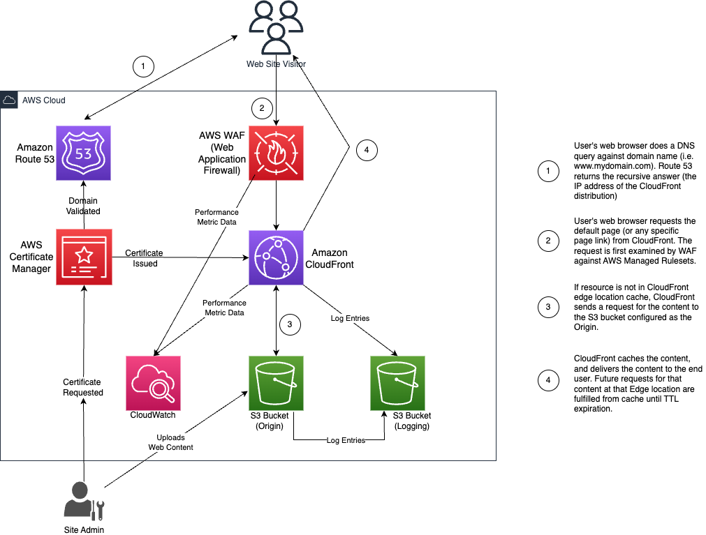

**About DNS**

DNS stands for "Domain Name System". It is the mechanism on the internet
which translates a name on the internet, called a Uniform Resource
Locator (URL) to an IP address that data can be routed to.

This starter kit requires DNS for your domain to be working properly in
order to deploy and for the website to function. DNS starts with
registering a domain name with a domain registrar. AWS provides domain
registration services, making it easy to deploy this kit with a
brand-new domain name. However, that isn't always the case. **There are
three potential DNS hosting scenarios. Review the scenarios below, find
the applicable scenario to your DNS requirement, then follow the
deployment steps in the applicable scenario.**

**DNS Scenario 1) A new domain name was purchased and registered in
Route 53 for the website.**

When a new domain is registered in Route 53, a public hosted zone is
automatically created for the domain. This public hosted zone contains
the Start of Authority (SOA) record and the list of the four name
servers that are considered to be the authority for responding to DNS
requests for the domain (NS records).

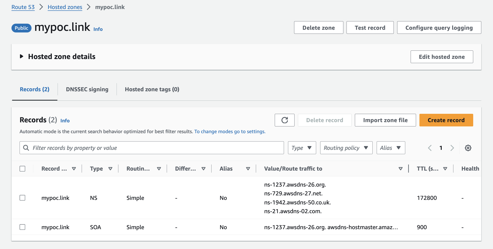

Deployment steps:

a)  Verify DNS functionality

b)  Deploy the Secure-Website-Starter-Kit template in CloudFormation

c)  Upload your website files to the S3 bucket

d)  Test by navigating to the URL in a web browser

**DNS Scenario 2) The domain name was registered in Route 53 but no
public hosted zone exists, or was transferred to Route 53 from another
registrar, or will be hosted in Route 53 with registration remaining
with a third-party registrar, and a public hosted zone has not yet been
created for the domain.**

Deployment steps:

a)  Deploy the create-hosted-zone template in CloudFormation.

b)  Verify DNS functionality.

c)  Deploy the Secure-Website-Starter-Kit template in CloudFormation.

d)  Upload your website files to the S3 bucket

e)  Test by navigating to the URL in a web browser

**DNS Scenario 3) DNS for the domain is hosted with a third party and
cannot be changed.**

Deployment Steps:

a)  Verify DNS functionality

b)  Manually create the certificate in AWS Certificate Manager

c)  Add the CNAME records from AWS Certificate Manager to your DNS zone
    in the third-party DNS management tool

d)  Verify the manually created certificate

e)  Deploy the Secure-Website-With-Third-Party-DNS template in
    CloudFormation

f)  Upload the website files to the S3 bucket

g)  Test by navigating to the URL in a web browser

**Verify DNS functionality**

Open a terminal session (Mac) or command prompt session (Windows). Type
the following command and press enter:

nslookup

Next, tell nslookup what query needs to be resolved; in this case, the
query will be nameservers (ns) records.

\>set q=ns

Type in the domain name. In the above example, I am using the domain
mypoc.link, which has a hosted zone in Route 53.

\>mypoc.link

If DNS is working correctly, the data returned will match the nameserver
records in your Route 53 hosted zone, or will match the nameserver
records in the DNS management portal with the third-party registrar or
DNS service you are using.

Below is a screenshot of the entire dialogue. Note the additional
commands "server" and "server 4.2.2.2". The "server" command tells you
what servers nslookup will query (usually these are the DNS servers that
your TCP/IP configuration has been assigned on your computer), and the
"server 4.2.2.2" command is setting the nameserver I wish to query to a
different DNS server on the internet. It's the "how to get a second
opinion" option of using the nslookup utility. Note that the nameservers
returned match the nameservers for the Route 53 hosted zone.

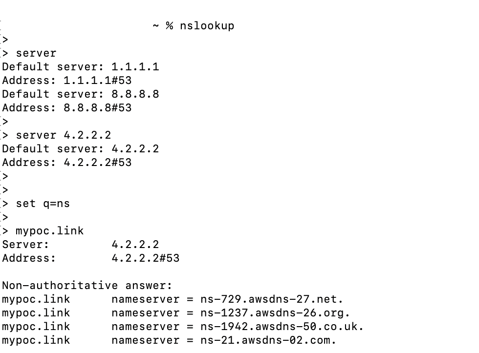

**Deploy the create-hosted-zone template in CloudFormation**

Stacks can be deployed in CloudFormation in two ways: by uploading a
CloudFormation template to an S3 bucket and proving the S3 object URL in
the stack details, or by uploading a template directly from your
computer. Neither is right or wrong; the difference is that when
uploading the file directly, an S3 bucket will be created for you in
each region that you deploy a stack, with a name that may or may not fit
your naming convention style. In this example, the template is stored in
an existing S3 bucket created by the admin. Select the checkbox next to
the template that is to be deployed, and click the Copy URL button.

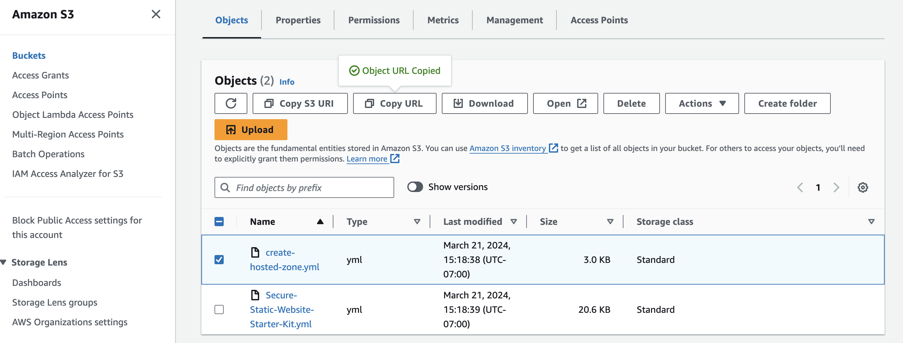

In the CloudFormation console, click the Create Stack button.

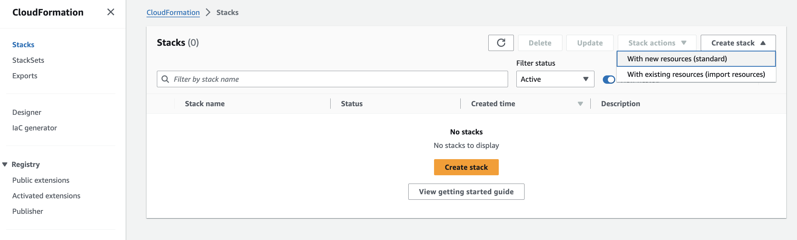

If you are uploading a template, select the Upload a template file
button. Otherwise, leave everything at the default and paste the Amazon
S3 URL location of your template file and click Next.

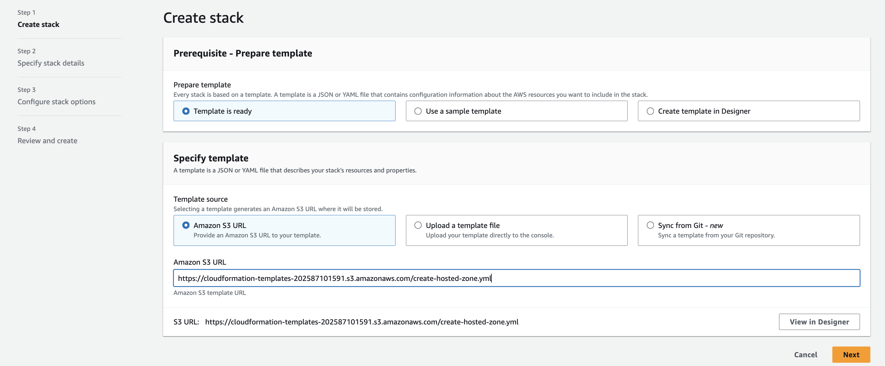

Give the stack a recognizable name, and enter the domain name. Click
Next.

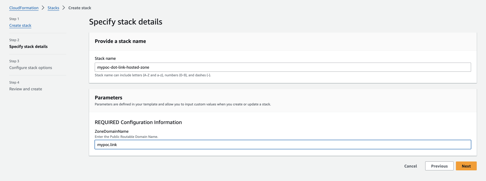

Scroll to the bottom of the page and click Next.

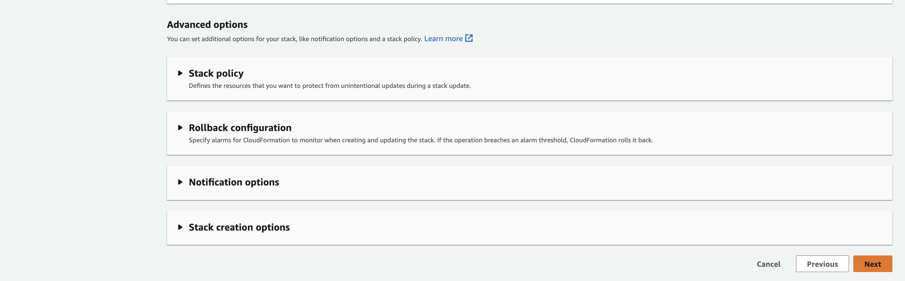

Scroll to the bottom of the page and click Submit.

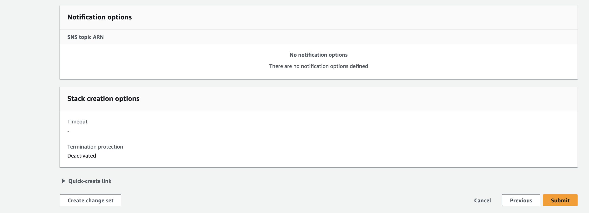

**Deploy the Secure-Website-Starter-Kit template in CloudFormation**

Navigate to CloudFormation. Click the Create stack button, selecting
"with new resources".

If the template file is saved in S3, select Amazon S3 URL and paste the
URL into the field. If you are directly uploading the template, select
upload a template file. Click Next.

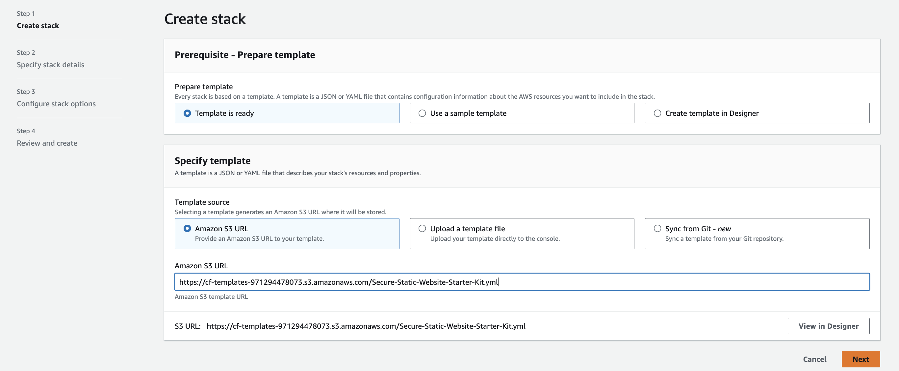

Give the stack a name. enter the domain name for the website and select
the DNS Hosting scenario.

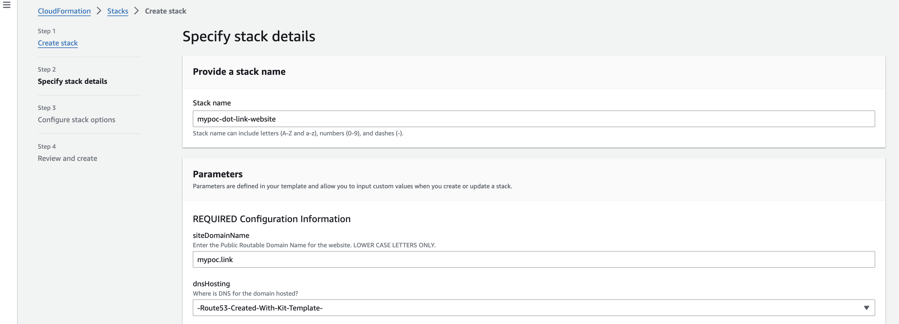{

If the zone is hosted in Route 53, enter the Hosted Zone ID in the
hostedZoneId field.

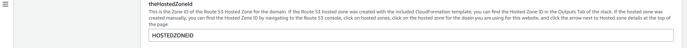

You can find the hosted zone ID in Route 53, by expanding the Hosted
zone details section like below:

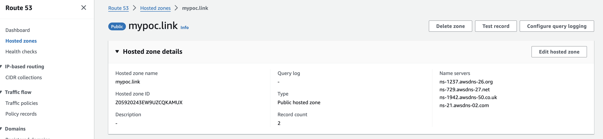

Or, if you created the hosted zone with the create-hosted-zone template,
the Hosted Zone ID can be found in the Outputs section of the stack.

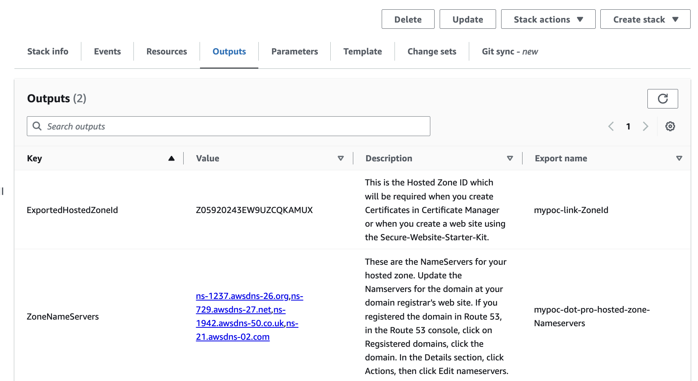

Next, choose the host or alias name for the website. Usually, this is
"www". If you would like the website to be reachable by the zone apex
(for example, by typing only the domain name in a browser address),
select true for createZoneApex. Enter the name of the default page and
error page (usually these are index.html and error.html but can be
changed if yours differ). The logForDays field indicates how long you
want the logs for the website to be retained.

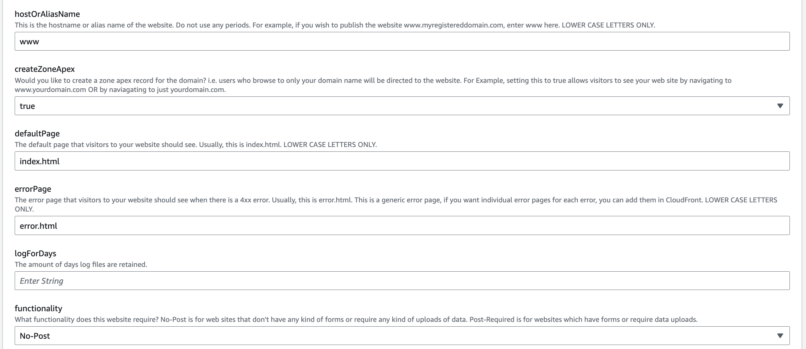

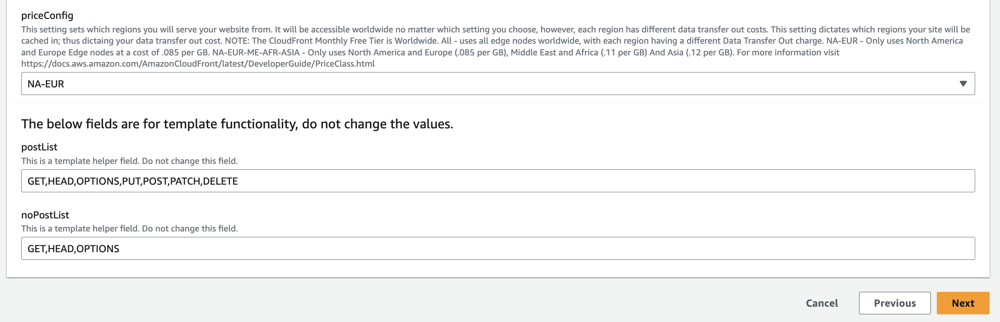

Click Next.

Click Submit.

**(If required) Manually create an SSL certificate in AWS Certificate
Manager**

Navigate to AWS Certificate Manager in the AWS console. Click the
Request button to request a new certificate.

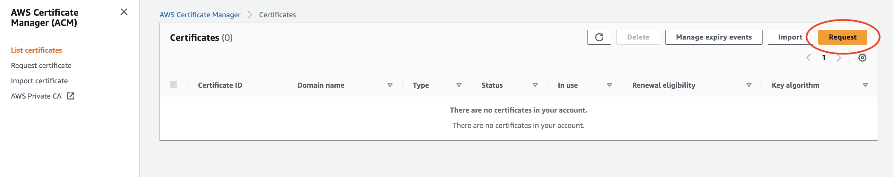

Select "Request a public certificate". Click Next.

In the Fully qualified domain name section, type in the domain names
that will be used for the website. In the example below, both
[www.mypoc.link](http://www.mypoc.link), and mypoc.link (the zone apex)
are added. If there are more hosts, you can add them as well. Note:
there is a balance here. Each certificate can have up to 10 domain
names; if there is any possibility that there may be a need for more
than 10 domain names on this certificate, you may opt to choose a
wildcard(\*) certificate for the domain. While this covers every
possible domain name, this may be more permissive than you may want, and
possibly result in more administrative overhead than desirable. For more
information, refer to the [AWS Certificate Manager
documentation](https://docs.aws.amazon.com/acm/latest/userguide/acm-limits.html).

Choose DNS Validation as the validation method.

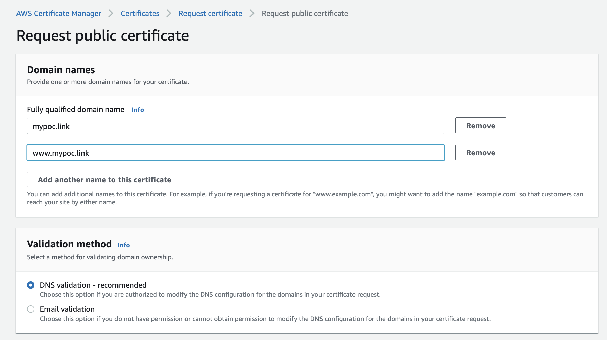

Choose the key algorithm that you require. Click Request.

Click the View certificate button to view your certificate.

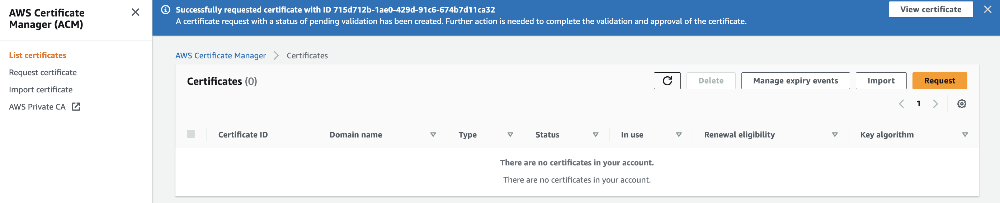

Note the domains section. In the scenario where a third party is hosting
DNS, the CNAME records will have to be added to the DNS zone in the
third-party DNS provider's portal for the domain.

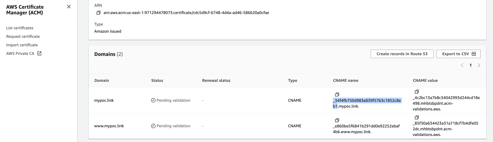

**(If required) Add CNAME records for AWS Certificate Manager domain
validation to your DNS zone with your third-party DNS management tool**

In the third-party DNS provider portal, add a new record for each domain
that was requested in the AWS Certificate Manager certificate. In the
example above, two domain names were requested, so each will be
validated. In the below example, we are using a third-party DNS provider
for DNS and will add the records as below. Note that in the Name field,
only the contents of the CNAME Name up to the top level domain name are
entered. In the above example, note which part of the CNAME Name was
highlighted to copy.

In the third-party DNS management portal, click to add a record.

Select CNAME as the record type.

Highlight and copy \_34f4fb750d983e839f5763c1852c8eb1 from AWS
Certificate Manager CNAME Name value for mypoc.link (the zone apex) and
paste that into the Name field in the CNAME record in the GoDaddy Create
Record dialog.

We copy the entire CNAME Value from the AWS Certificate Manager CNAME
Value field for mypoc.link and paste it into the Value field in the
GoDaddy Create Record Dialog.

Click Save.

For domains which are not the zone apex (i.e. www), the CNAME Name
should be entered like: \_e860be5f6841b291dd0e92252ebaf4b6.www (no
trailing .).

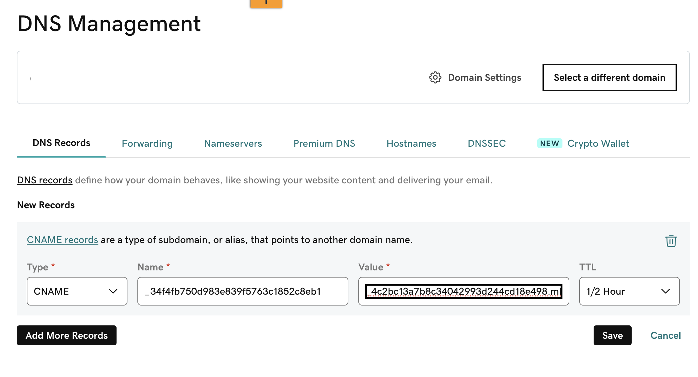

After adding, the correct CNAME records in the GoDaddy portal would
display as:

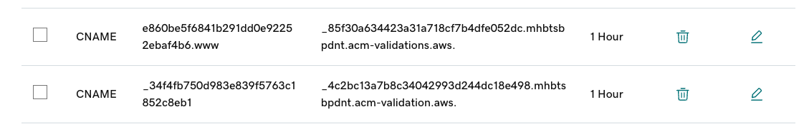

Which correspond to the domain data in AWS Certificate Manager.

**Verify the manually created SSL Certificate in AWS Certificate
Manager**

Usually, between 10-30 minutes after adding the CNAMEs to DNS,
refreshing the view of the Domains in AWS Certificate shows an updated
status of Success.

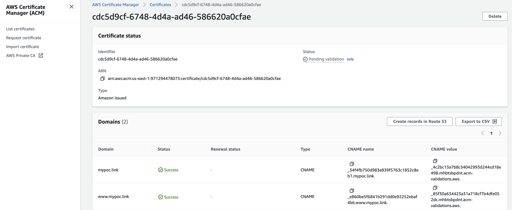

If the status does not update to success, verify that:

-   The CNAME Name and values in the AWS Certificate Manager domains
    exactly match the CNAME record name and values in your Third-Party
    DNS management portal.

-   Consult the help for your Third-Party DNS provider and ensure that
    record values can contain leading underscores. Some DNS providers
    may not allow this; and in that case, removing the leading
    underscore from the VALUE field only is permissible (the leading
    underscore in the Name field must remain intact).

For more information, see the AWS Certificate Manager Documentation for
additional troubleshooting steps.

**Deploy the Secure-Website-With-Third-Party-DNS template in
CloudFormation**

Navigate to CloudFormation. Click the Create stack button, selecting
"with new resources".

If the template file is saved in S3, select Amazon S3 URL and paste the
URL into the field. If you are directly uploading the template, select
upload a template file. Click Next.

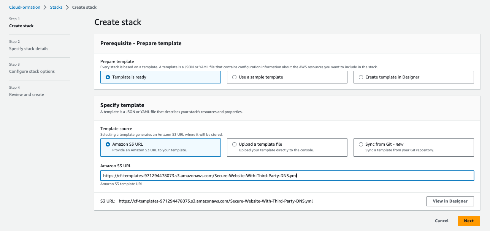{width="6.5in"
height="3.0680555555555555in"}

Give the stack a recognizable name. Provide the domain name, host name,
and whether the Zone Apex is required. Provide the Amazon Resource Name
(ARN) for the certificate in the CertificateArn field. The Certificate
ARN can be found in AWS Certificate Manager in the Certificate status
section. (See picture with red circle above)

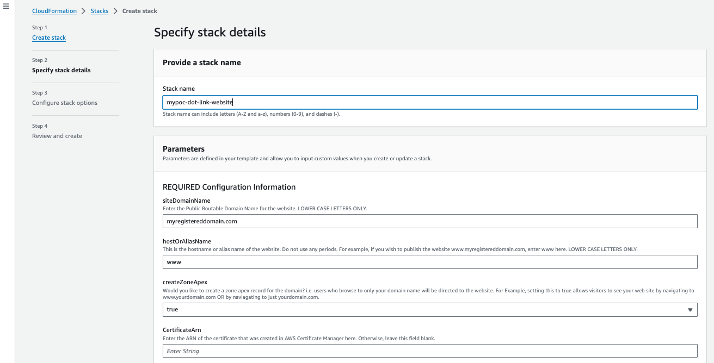

Provide the default page and error pages, and the number of days that
are required for log retention. Click Next.

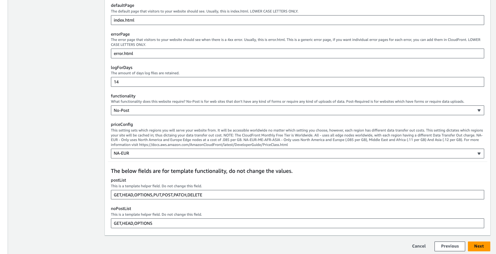

**Click Next.**

Click Submit.

**(If required) Add host records for the website in third-party DNS
portal**

In CloudFormation, select the stack created with the
Secure-Website-With-Third-Party-DNS template. Click on the Resources
tab. Click on the link for the CloudFront Distribution, which links to
the CloudFront distribution details in the AWS Management Console.

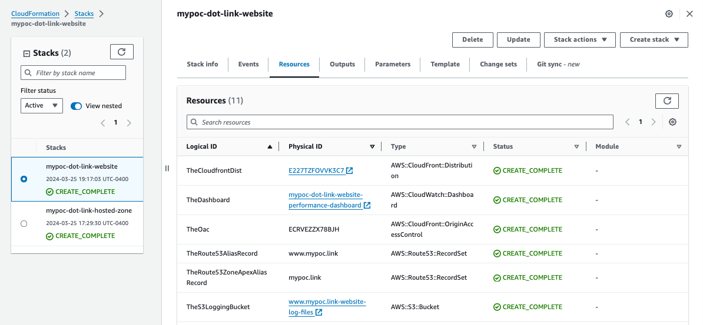

Copy the distribution domain name.

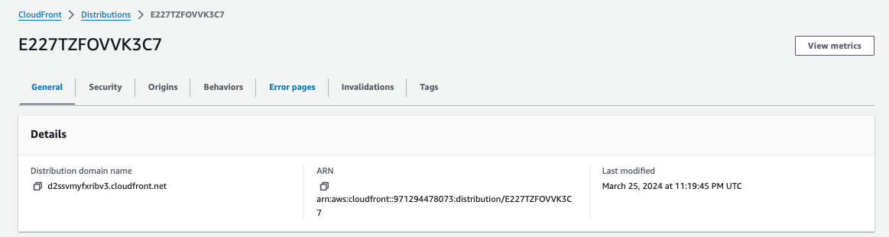

Create a new CNAME record in the Third-Party DNS portal for each domain.

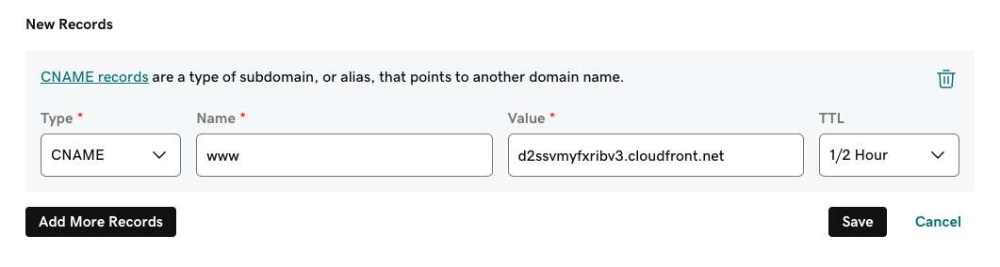

This record will display as:

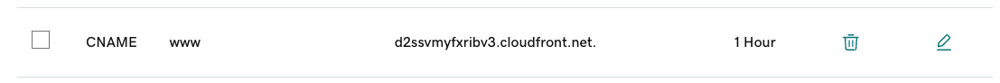

Note: For zone apex records, some sites will accept a host record of
"A", some sites will accept a CNAME of "@", and some site may require a
forwarder to the domain name from the www CNAME. Check your DNS
provider's documentation for details.

**Upload the website files to the S3 bucket**

In the AWS Console, Navigate to S3. Click on the bucket named
\<domainName\>-website-files. In the bucket screen, click the Upload
button.

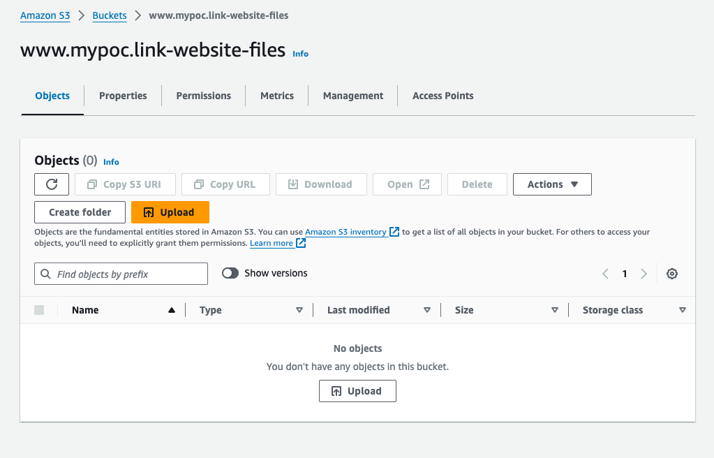

Placing website files in this S3 bucket is similar to putting web files
in an Apache Web Server in the /var/www/html folder. Click the Add
folder button. Upload each folder such as img, js, or ccss into the S3
bucket. Then upload the remaining files by clicking the Add files
button.

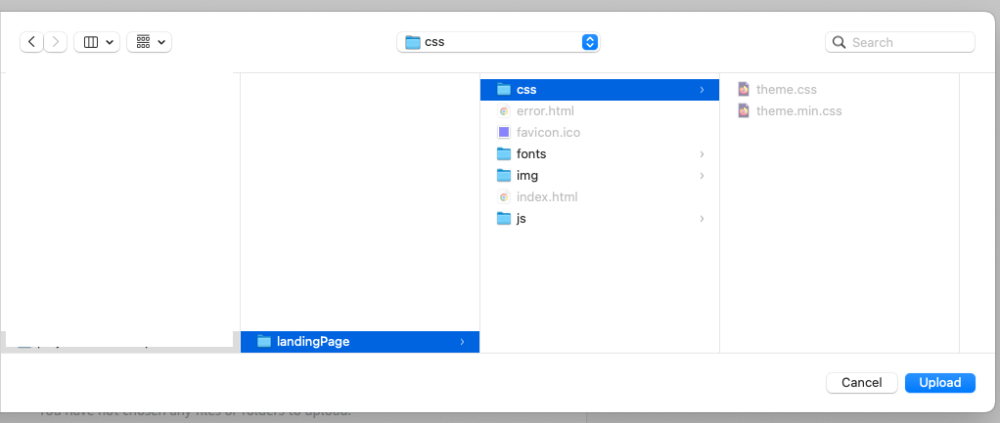

Once all of the folders and files have been selected for upload, click
the Upload button at the bottom of the page.

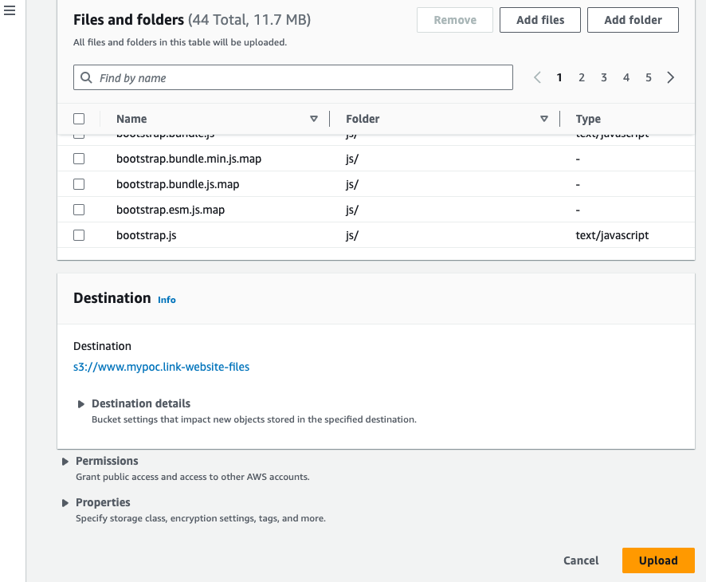

Do not navigate away from the page during the upload.

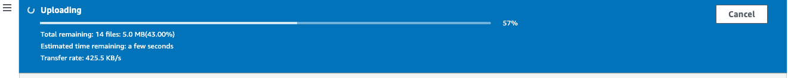{width="6.5in" height="0.65in"}

Once finished, the upload box will be green. Click the Close button.

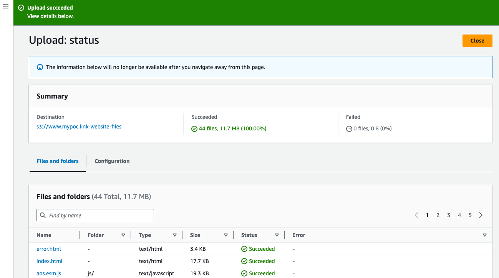

**Test the website by navigating to it in a web browser.**

Test the following functionality:

1)  If a zone apex is selected, test <https://yourdomain.com> (replace
    yourdomain.com with your actual domain name). Ensure that the
    certificate shows as validate and that https is functioning.

2)  Test <https://www.yourdomain.com> (replace yourdomain.com with your
    actual domain name) Ensure that the certificate shows as validate
    and that https is functioning.

3)  Test <http://www.yourdomain.com> (replace yourdomain.com with your
    actual domain name). This should redirect to https://.

4)  Click all links and menu items on your page an ensure that all links
    are working as intended.
