**Starter Kits**

**Windows Migration Deployment Guide**

## Introduction

This Starter Kit comes in 2 parts (AZ-Mapper and
Windows-Migration-Starter-Kit) and will deploy the following AWS
Services:

-   A Virtual Private Cloud with 2 availability zones, 2 Public Subnets,
    4 Private Subnets, and an Internet Gateway. This Starter Kit deploys
    domain controllers in 2 availability zones and subnets for
    resiliency. No resources in this Starter Kit will be deployed to the
    Public Subnets or exposed to the Public Internet.

-   1 NAT Gateway.

-   2 Amazon EC2 Instances of type t3a.small or t3.small (2 vCPU, 2GB
    RAM) for the Domain Controllers

-   1 Amazon EC2 Instance of type m6a.large or m6i.large (2 vCPU, 8GB
    RAM) for the File Server

-   Security Groups for the instances

-   1 Virtual Private Gateway, which is used to connect the VPN Tunnel
    to the VPC.

-   1 Customer Gateway which is used to connect the VPN Tunnel to the
    Customer Gateway device.

-   2 Site-to-Site VPN Tunnels between the On-Prem location and the VPC,
    which is the standard configuration

-   An AWS Key Management Service customer-managed key for encryption of
    backups and SNS topics at rest.

-   AN AWS Backup vault.

-   An AWS Backup 1-year retention backup plan, which provides
    hourly/monthly backups with a 1-hour RPO and a 1-hour RTO.

-   AWS Systems Manager Foundation which includes Fleet Manager (the
    ability to RDP and SSH from the AWS Console)

-   1 Amazon CloudWatch dashboard with widgets for VPN Tunnel state, CPU
    utilization of the servers, and Disk Health of the File Server Share
    Volume

-   Amazon CloudWatch alarms for that monitor for critical issues and
    send email alerts

-   Helper scripts which can automate the migration of the servers if
    the administrator wishes to use them.

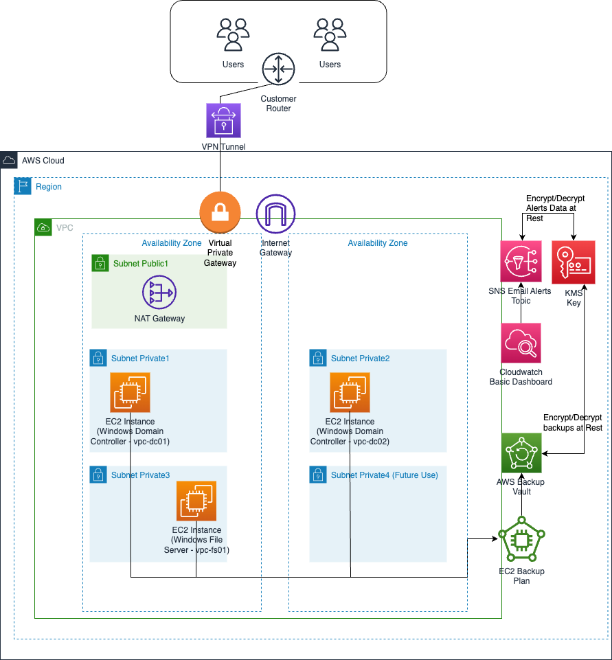

The time to deploy the solution and migrate the on-premises domain is
under 1 hour, excluding file server replication time or any advanced
requirements.

This Starter Kit was tested with a virtual Windows domain consisting of
a Domain Controller, File Server, and workstation running in an on-prem
(not in any cloud) virtual environment, with user accounts roaming
profiles and home directories. **[It is highly recommended that a test
environment is set up which replicates the existing on-prem resources,
and the migration is tested prior to attempting to migrate a production
Windows domain.]{.underline}** This is especially true when migrating
Windows domains that are at the Windows 2012 or earlier functional
level; any applications that are integrated with Active Directory should
be tested at the current Windows 2016 functional level prior to
attempting migration.

This technology uses AWS CloudFormation to create all of the required
resources. AWS CloudFormation is an AWS service which enables groups of
resources (called Stacks) to be created in an automated fashion through
the use of templates. This saves the AWS Partner considerable time,
allowing the partner to concentrate on migrating the resources rather
than the creation of them. The CloudFormation Stack is created from a
YAML template which can be uploaded from your computer or S3 bucket
using the S3 object URL. Your Distributor will provide either the
template files or the URL for the location of the Starter-Kit Template.

This deployment guide serves to make a migration to AWS as easy as
possible; however, it is not a complete guide for Microsoft Windows
deployments. There may be additional Windows Roles or Features that may
require additional installation or additional configuration outside of
the scope of this document. While this Starter Kit deploys the member
server as a file server, you could use the server for any role you
needed if necessary.

[]{#sharedresp .anchor}Please refer to the AWS Shared responsibility
model to learn more about the security of the resources deployed with
this Starter Kit. While AWS is responsible for the security ***OF*** the
cloud (security of the physical datacenters, physical network, physical
storage, and hypervisors), the Partner and Customer are responsible for
the security ***IN*** the cloud. Basic Principles of Security in the
cloud are (but not limited to):

-   Amazon EC2 Instance Operating Systems should be updated as updates
    are released.

-   Installed applications should be updated as updates are released.

-   Data should be encrypted at rest and in transit. The instances in
    this Starter Kit are built with disks that are encrypted with the
    built-in AWS Key Management Service key.

-   The principle of least privilege should apply to granting any access
    to resources. The Security Groups in this Starter Kit are built
    based on least access; no ports are open to any other services than
    are required by Windows.

To learn more, see the AWS Shared Responsibility Model at
<https://aws.amazon.com/compliance/shared-responsibility-model/>

Note the following default network values for your
Starter Kit template. If the default IP Address and CIDR assignments do
not overlap with the existing on-premises network, the default values
should work fine without any changes.

-   AWS VPC CIDR: 10.32.0.0/16

-   AWS VPC Domain Controller 1 IP: 10.32.8.4/24

-   AWS VPC Domain Controller 1 Name: vpc-dc01

-   AWS VPC Domain Controller 2 IP: 10.32.8.132/24

-   AWS VPC Domain Controller 1 Name: vpc-dc02

-   AWS VPC File Server IP: 10.32.10.4/24

-   AWS VPC File Server Name: vpc-fs01

You will be prompted to input these values when deploying the
CloudFormation template; however, if the above default values are
acceptable, you can leave the inputs at their defaults. For the example
migration in this document, the defaults will be used with a Windows
Domain name mypoc.link.

**Important Note!**

AWS Workspaces is a virtual desktop
solution that can be integrated with this Starter-Kit as an add-on.
However, please note that WORKSPACES IS AVAILABLE IN THE US-WEST-2
(Oregon), CANADA-CENTRAL-1, and US-EAST-1 (N. VIRGINIA) REGIONS. It is
recommended that this Starter-Kit is ONLY deployed in either of those 2
regions for Workspaces Add-On compatibility. For more information on
Workspaces and Regional Availability please see
<https://docs.aws.amazon.com/workspaces/latest/adminguide/azs-workspaces.html>

## Deployment

**Prior to beginning the migration, it is imperative that:**

-   **Windows time is set correctly on the existing domain controller
    and is synced and working properly in the Windows domain**

-   **DNS is tested and working properly**

-   **The health of the on-premise domain has been verified with a tool
    such as Windows dcdiag.exe.**

-   **Windows Firewall should be configured to allow all AD
    Communication between domain controllers.**

**If there are any issues with Time, DNS, Network Connectivity, or
Domain Controller health, you may have problems with the migration.**

[]{#deploymentstep1 .anchor}**Step 1) Gather the required information
necessary to migrate your domain. (5 minutes)**

a)  CIDR Block of on-premises network

\_\_\_\_\_\_\_\_\_\_\_\_\_\_\_\_\_\_\_\_\_\_\_\_\_\_\_\_\_\_\_\_\_\_\_\_\_\_\_\_\_\_\_\_\_\_\_\_\_\_\_\_\_\_\_\_\_\_\_\_\_\_\_\_\_\_\_\_\_\_\_\_

b)  IP Address of the on-premises Domain Controller

\_\_\_\_\_\_\_\_\_\_\_\_\_\_\_\_\_\_\_\_\_\_\_\_\_\_\_\_\_\_\_\_\_\_\_\_\_\_\_\_\_\_\_\_\_\_\_\_\_\_\_\_\_\_\_\_\_\_\_\_\_\_\_\_\_\_\_\_\_\_\_\_

c)  Windows Domain Name used for the on-premises domain

> \_\_\_\_\_\_\_\_\_\_\_\_\_\_\_\_\_\_\_\_\_\_\_\_\_\_\_\_\_\_\_\_\_\_\_\_\_\_\_\_\_\_\_\_\_\_\_\_\_\_\_\_\_\_\_\_\_\_\_\_\_\_\_\_\_\_\_\_\_\_\_\_

d)  Public IP Address of the on-premises Firewall/Gateway Device

\_\_\_\_\_\_\_\_\_\_\_\_\_\_\_\_\_\_\_\_\_\_\_\_\_\_\_\_\_\_\_\_\_\_\_\_\_\_\_\_\_\_\_\_\_\_\_\_\_\_\_\_\_\_\_\_\_\_\_\_\_\_\_\_\_\_\_\_\_\_\_\_

e)  Email Address where alerts should be sent

\_\_\_\_\_\_\_\_\_\_\_\_\_\_\_\_\_\_\_\_\_\_\_\_\_\_\_\_\_\_\_\_\_\_\_\_\_\_\_\_\_\_\_\_\_\_\_\_\_\_\_\_\_\_\_\_\_\_\_\_\_\_\_\_\_\_\_\_\_\_\_\_

f)  (Optional) Computer Name of on-premises File Server

\_\_\_\_\_\_\_\_\_\_\_\_\_\_\_\_\_\_\_\_\_\_\_\_\_\_\_\_\_\_\_\_\_\_\_\_\_\_\_\_\_\_\_\_\_\_\_\_\_\_\_\_\_\_\_\_\_\_\_\_\_\_\_\_\_\_\_\_\_\_\_\_

g)  (Optional) File share names-on-premises File Server

\_\_\_\_\_\_\_\_\_\_\_\_\_\_\_\_\_\_\_\_\_\_\_\_\_\_\_\_\_\_\_\_\_\_\_\_\_\_\_\_\_\_\_\_\_\_\_\_\_\_\_\_\_\_\_\_\_\_\_\_\_\_\_\_\_\_\_\_\_\_\_\_

**Step 2) Create a new site in Active Directory Sites and Services for the AWS VPC.** **(2 minutes)**

Open Active Directory Sites and Services. Click Action in the menu bar
and click New Site. Provide a site name, such as aws-vpc. Select
DEFAULTIPSITELINK as the transport for the site link and click OK.

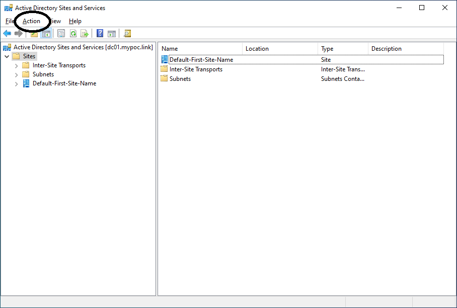

**Step 3) Create the subnets for the AWS VPC in Active Directory Sites and Services. (2 minutes)**

In Active Directory Sites and Services, right-click Subnets then click
New Subnet. For Prefix, add the subnet for the Private1 subnet (the
default is 10.32.8.0/28). In the "Select a site for this Prefix window,
select the aws-vpc site.

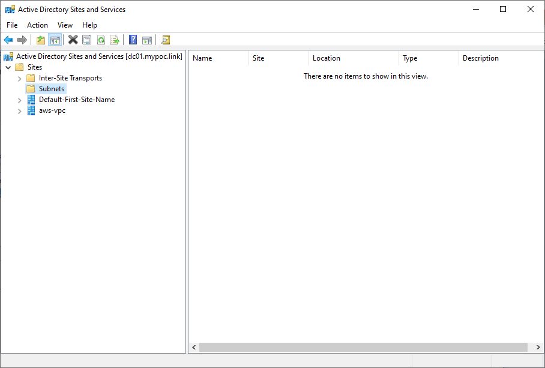

The Starter-Kit Default subnets are: 10.32.8.0/28, 10.32.8.128/28,
10.32.10.0/24, and 10.32.11.0/24. Create the subnets in the aws-vpc-
site. If the on-prem subnet was not created and associated to the
default-first-site-name site, this can be done now.

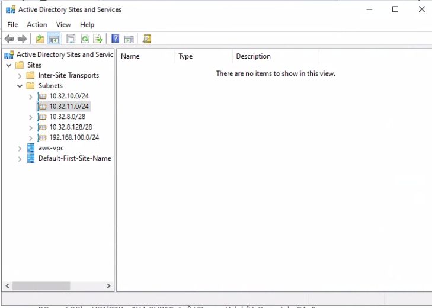{

**Step 4) Create the reverse DNS zones forthe AWS VPC. (2 minutes)**

In DNS Management, select Reverse Lookup Zones, click Action in the top
menu, and click New Zone. (If you do not have a Reverse Lookup Zone for
the on-premises Subnet, it should be added now as well).

The type of Zone you wish to create is a primary zone. Click Next.

Replicate data to all DNS servers running on domain controllers in this
forest. Click Next.

Select IPv4 Lookup zone. Click Next.

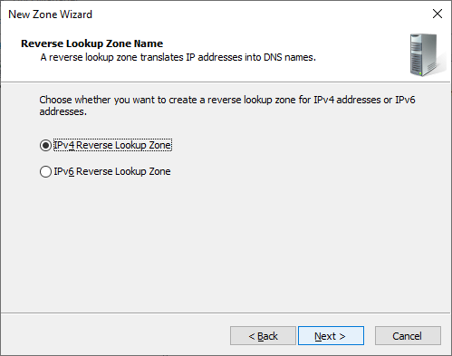

For the network ID, use the first 3 octets of the subnet. For example,
for the subnet 10.32.8.0/24, you would input 10.32.8 in the Network ID
field. Click next.

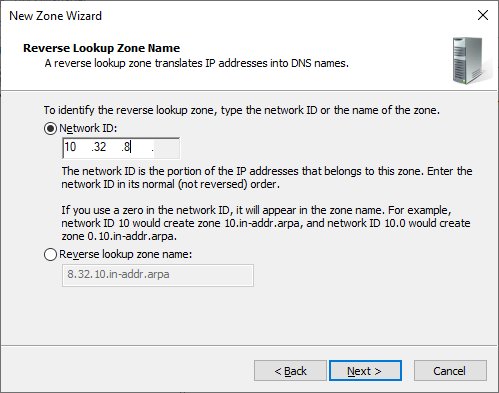

Select "Allow only Secure dynamic updates" and click next.

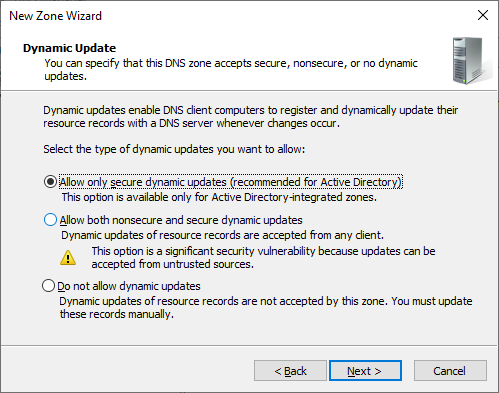

Click Finish.

Repeat this step as necessary for each subnet.

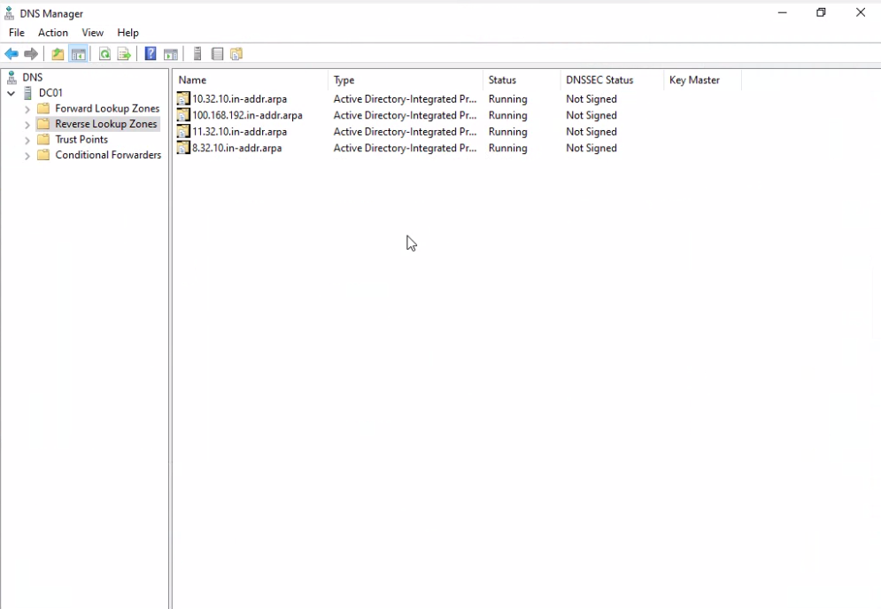

**Step 5) Deploy the resources using CloudFormation. (10 minutes)**

Navigate to CloudFormation.

Ensure that you are in the correct region that you wish to deploy the
Starter Kit to. If you need to change the region, click on the region in
the nav bar to show the drop-down menu.

After ensuring you are working in the correct region, click the Create
stack button.

Select Upload a template file in the Specify template section. Click the
Choose file button, which opens a file explorer window on your computer.
Select the azmapper.yml file provided by your Distributor.

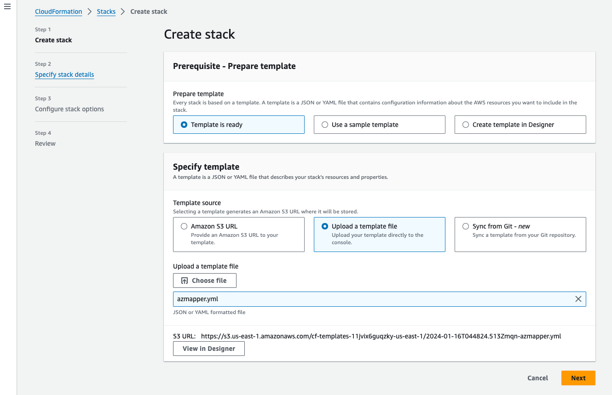

Enter a stack name, then click the Next button.

Please note that the Stack Name also serves as a variable to name many
of the components of the Starter-Kit; for example, if the stack is named
"windows-migration", then the backup vault will be named
"windows-migration-backup-vault". Keep this in mind when creating your
stack name.

Scroll to the bottom of the page and click Next.

Scroll to the bottom of the page. Check the box to acknowledge that the
template may create IAM resources (it creates an IAM role that has
permission to create resources in the stack, so this is OK). Click
Submit.

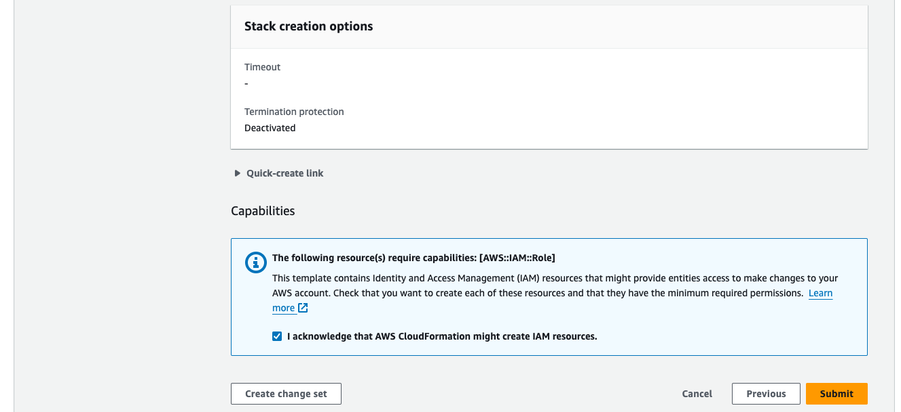

Next, create the Windows Migration Stack. In the left menu, click
stacks. Then click the Create Stack button, and select "With new
resources". Select the template that was provided by your Distributor.
Again, we will select upload a template file in the Specify template
section, click Choose file, then select the template file that was
provided.

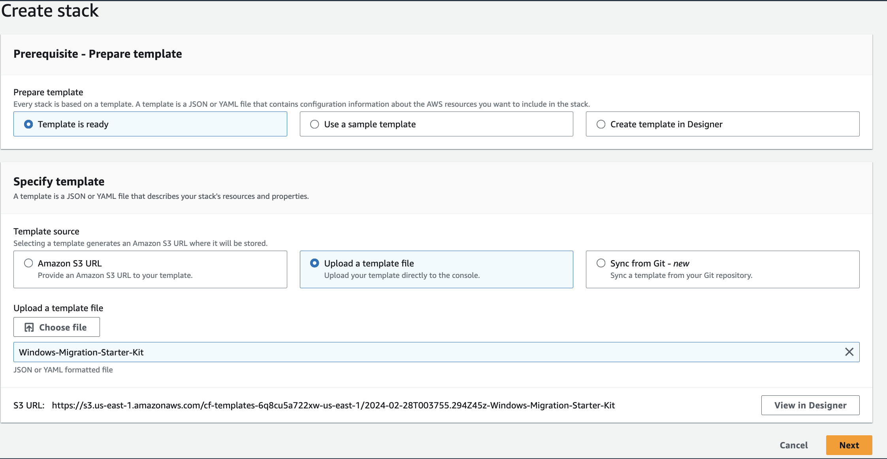

We give this a stack name.

Please note that the Stack Name also serves as a variable to name many
of the components of the Starter-Kit; for example, if the stack is named
"Migrated-Windows-Domain", then the backup vault will be named
"Migrated-Windows-Domain-backup-vault". Keep this in mind when creating
your stack name.

In the REQUIRED Information section, enter the required information.

If you would like a helper script created for file server migration,
enter your on-prem file server and shared folders in the OPTIONAL File
Migration Automation section. If you are migrating your file server
manually, you can omit this step.

If the default IP Addresses and computer names will work (and they
should in most cases) you can skip the OPTIONAL fields and click next at
the bottom of the page.

The rest of the defaults are acceptable. Click Next.

On the final screen, you can review the stack configuration. Scroll to
the bottom of the page, and in the Capabilities section, activate the
check box to accept that CloudFormation might create IAM resources.
(This template creates the necessary IAM resources to run the
Starter-Kit, such as a role to run the backup jobs, a role that enables
management through SSM, and a least-privilege group which allows users
to log into the console and ONLY access remote desktops via Systems
Manager).

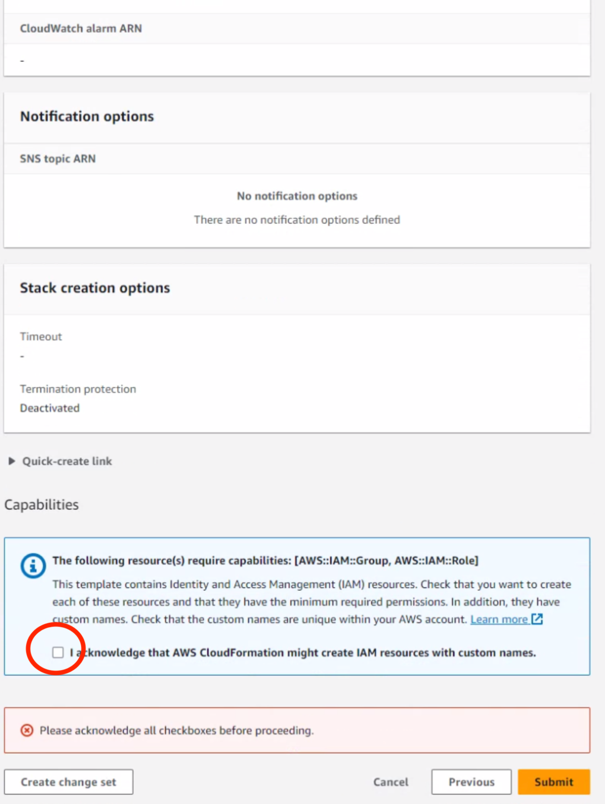

After completion, your CloudFormation Stacks should show two completed
stacks:

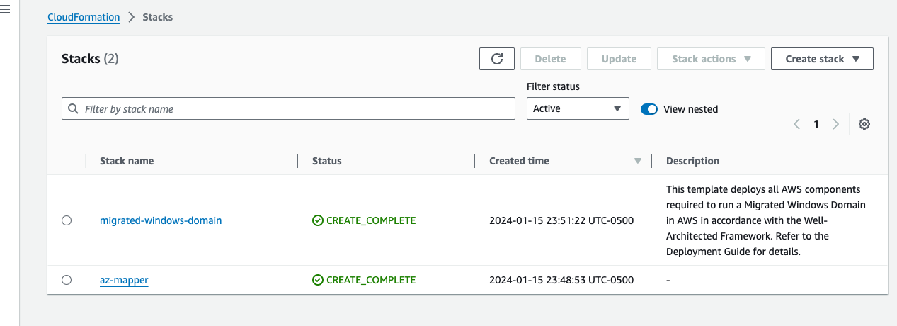

**Step 6) Confirm your subscription to the SNS Topic that will send your alerts about the services. (1 minute)**

You should have received an email from "AWS Notifications" at the email
address that you entered when the stack was created in CloudFormation,
which will contain a link which confirms that you have subscribed to
notifications for this Starter-Kit. Click on the link. You will be
directed to a web page that will confirm that the email address is now
subscribed.

**Step 7) Get the Configuration Help File for the Site-to-Site VPN. (2 minutes)**

In the AWS Console, navigate to VPC.

In the left menu, click on Site-to-Site VPNs.

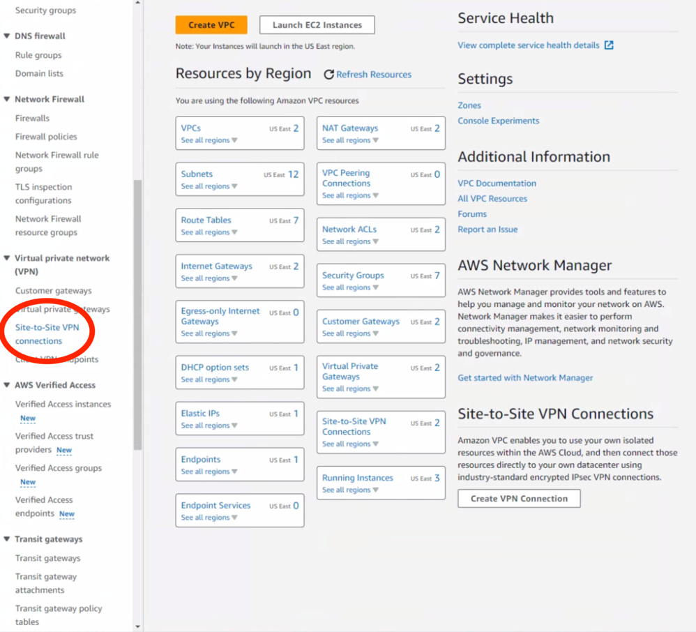

Click the radio button for the Site to Site VPN and click the "Download
Configuration" Button.

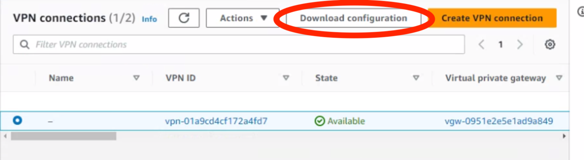

Select the configuration for your On-Premises Firewall via the drop down
menu provided.

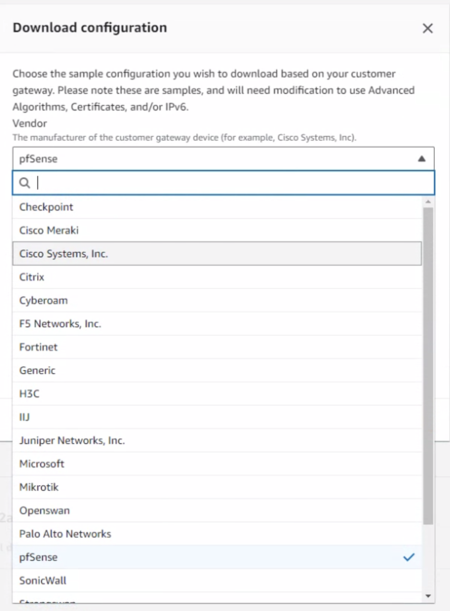

Click the Download button.

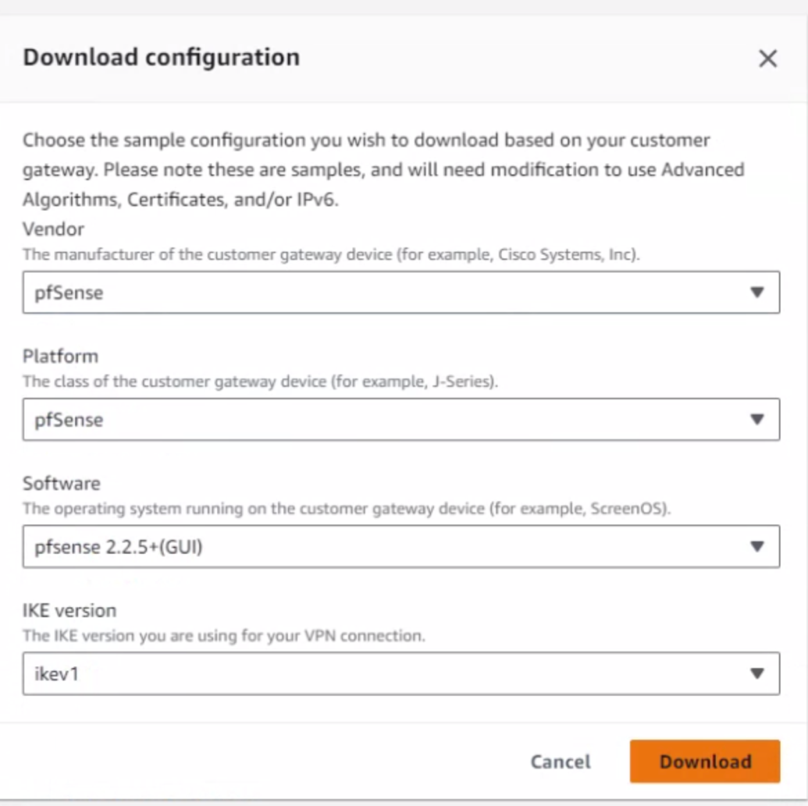

**Step 8) Configure the VPN Tunnel on theon-prem Gateway. (10 minutes)**

Follow the instructions in the Configuration File to create the VPN
Tunnels in the on-premise gateway device.

In accordance with the shared security model, it is the administrator's
responsibility to secure the tunnel with the latest best practices that
use strong encryption settings. You can refer to the example in the
downloaded configuration file which contains the minimum required
security configuration for connections to AWS GovCloud for an example or
use the parameters below which are current NIST recommended *minimum*
IPSEC Tunnel Configuration parameters.

-   IKE Version: 2

-   Phase 1 Encryption Algorithm: AES256-GCM

-   Phase 1 Key Length: 128 bits

-   Phase 1 Hash: SHA256

-   Phase 1 Diffie-Hellman Group: 19

-   Phase 2 Remote Network: 10.32.0.0/16

-   Phase 2 Protocol: ESP

-   Phase 2 Encryption Algorithm: AES256-GCM

-   Phase 2 Key Length: 128 bits

-   Phase 2 Perfect Forward Secrecy (PFS): 19

You can substitute the above values in the specific configuration for
your device. Note that some devices may not support some values (i.e.,
some older gateway devices may not support IKE version 2).

Note that AWS creates 2 VPN tunnel endpoints when a Site-to-Site VPN is
created, for

connection resilience. In the configuration file, you will find
configurations for 2 connections. While the second connection is not
mandatory, using both will add resiliency to your connection.
Additionally, if your on-premises gateway is a high-availability, dual
hardware solution, you can create one tunnel in each gateway device for
even better resiliency.

**Step 9) Obtain the Administrator Password for DC1. (5 minutes)**

In the AWS Console, navigate to AWS Systems Manager.

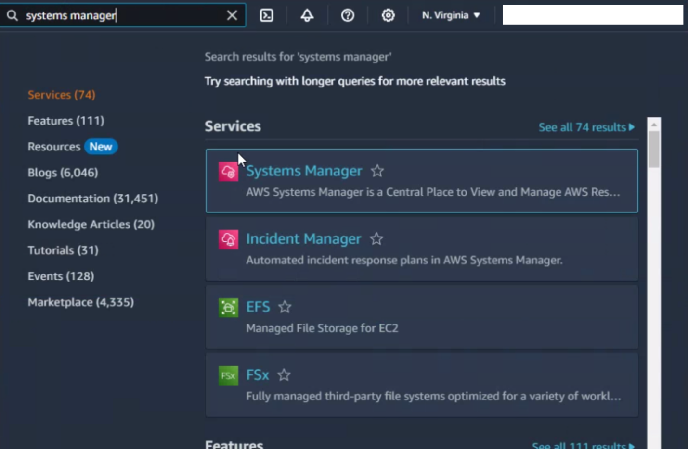

In the hamburger menu, click Parameter Store.

Click on the link for the key (starts with /ec2/keypair).

Click "Show" under Value.

Copy the key to the clipboard.

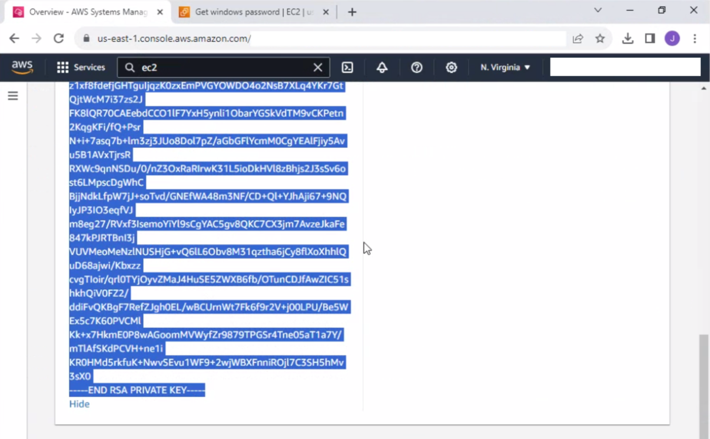

Open the Amazon EC2 console in a new browser tab.

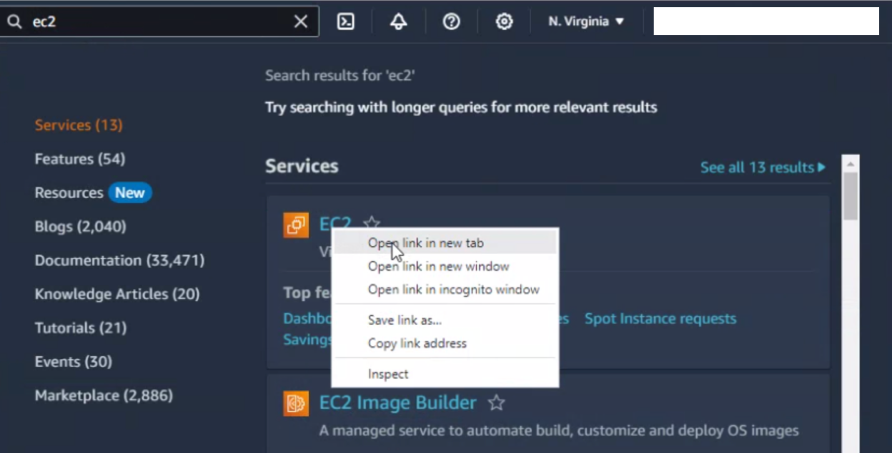

In the Amazon EC2 Dashboard, click Instances (running).

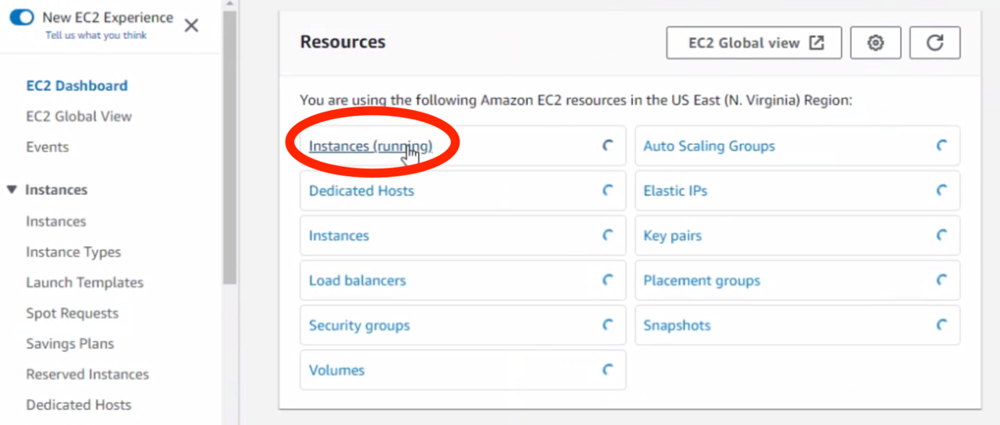

Check the box next to vpc-dc01. Click Actions, then click Security, then
Click "Get Windows Password".

Paste the key from AWS Systems Manager Parameter Store (should be in
your clipboard) and click "Decrypt Password".

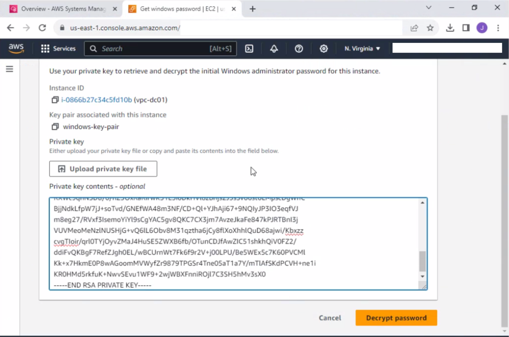

Copy the password to your clipboard after decrypting.

For convenience, you may wish to keep the Parameter Store Tab and EC2
tab open during migration to make logins easier. Note that each instance
will have its own password -- you can use the key from parameter store
to decrypt each password, but each instance will have a different
password to decrypt.

**Step 10) Connect to the vpc-dc01 instance**
via the Remote Desktop Connection App on your Windows workstation. (1
minute)**

Use the private IP address that was assigned (default is 10.32.8.4). For
credentials, click on "User other account", and for the username, use
local\\administrator and use the decrypted password for that Windows
instance.

When prompted for the password, paste your Windows password in the
dialog box.

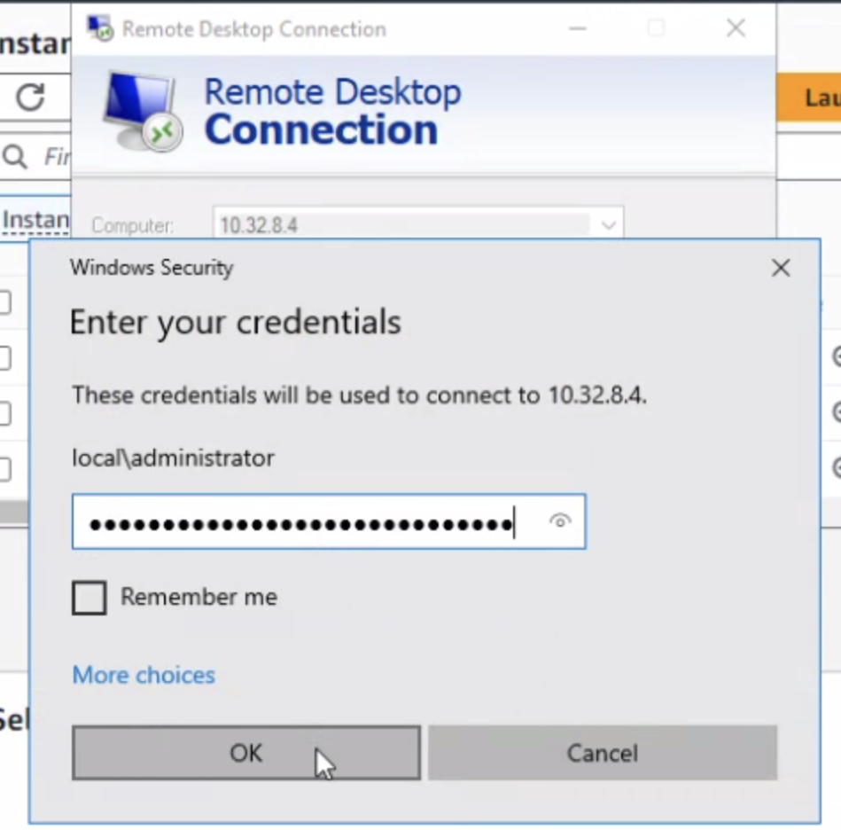

Once logged in, it is best practice to change the local administrator
password to whatever complies with your security/governance standards.

<b>Ensure that Windows time is correct and that it is configured for the
correct time zone before continuing</b>

tep 11) Join vpc-dc01 to the domain and promote to a domain controller.**

Navigate to C:\\Helper-Scripts. Right click on 1_Join-On-Prem-Domain and
click Run with PowerShell.

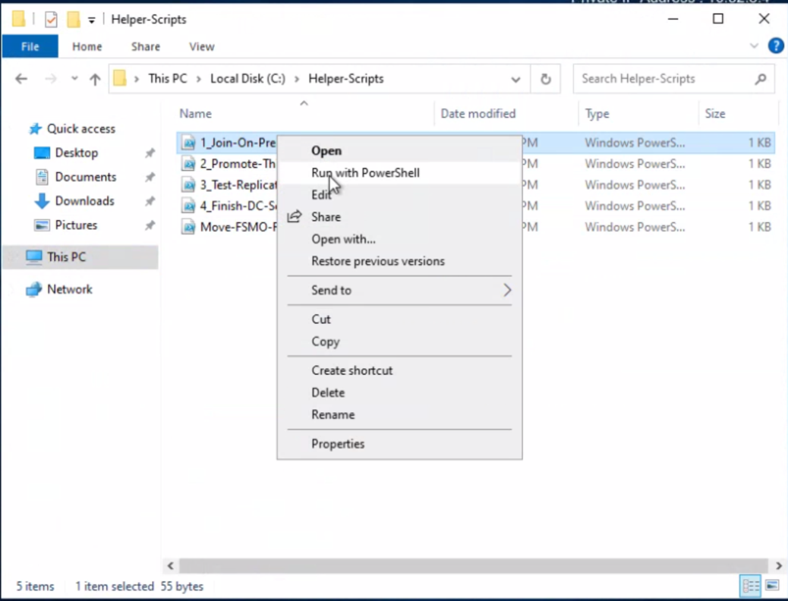

When prompted for confirmation of execution policy change, Type A and
press enter.

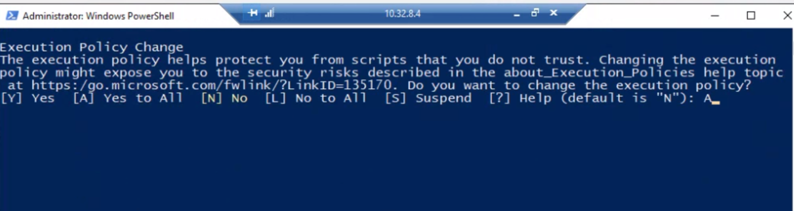

When prompted, enter the domain administrator credentials (or
credentials of a user with permission to join computers to a domain).

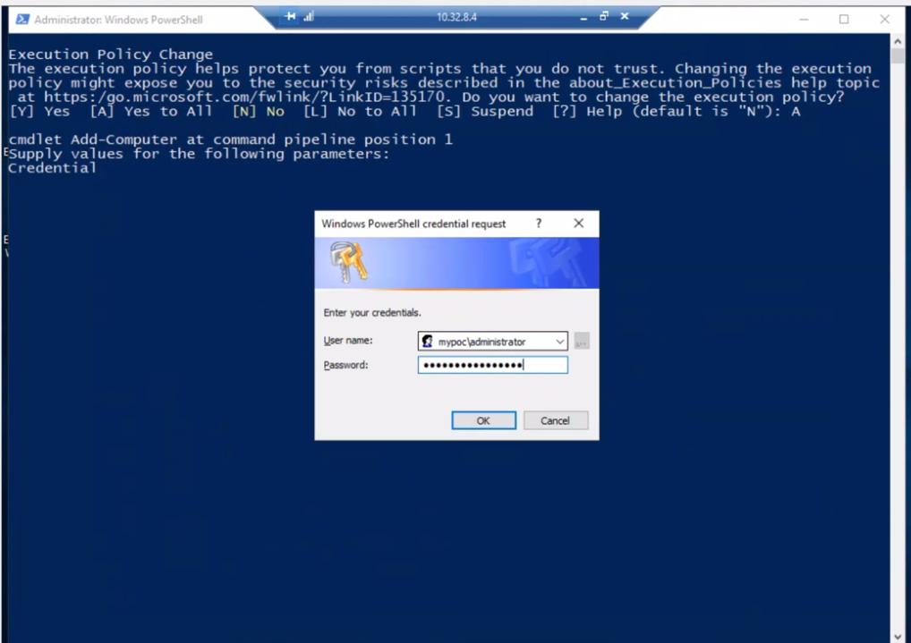

The Instance will reboot automatically when complete.

Log back into vpc-dc01.

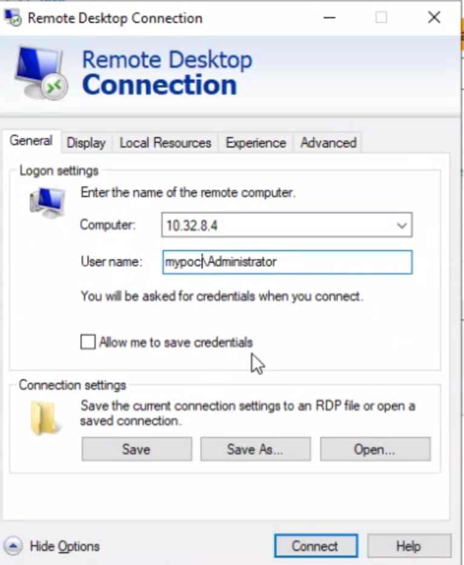

Navigate to C:\\Helper-Scripts, right click 2_Promote-This-Server-To-Domain-Controller and click Run with
PowerShell.

When prompted to change the execution policy, Type A, then press enter.
When prompted for the Domain Services Restore Mode password, enter the
password you wish to use for any Active Directory Restore operations.
When prompted to continue with this operation, type A, then press enter.

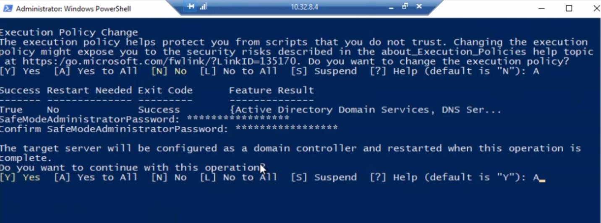

Click Close to sign out and allow the instance to reboot.

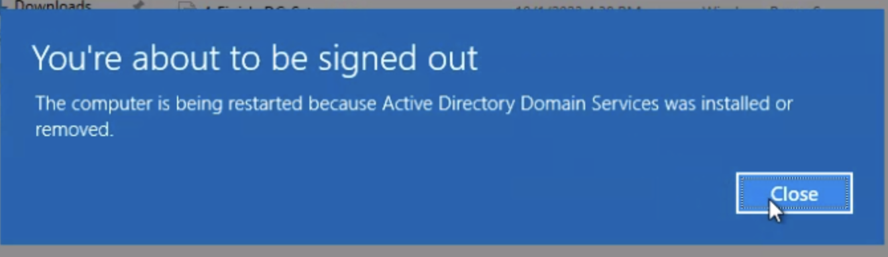

**Step 12) Verify DNS and Replication in the domain. (5 minutes)**

***In the On-Prem Domain Controller***, Open DNS Management, and click
on the domain name in the left pane.

Verify that there is a name server record for the VPC Domain Controller.

Open a file explorer window.

In the address bar, type [\\\\vpc-dc01\\sysvol] and press enter (If you customized the name of the VPC domain controller, use that name).

The contents of the SYSVOL folder on the VPC-based domain controller
should be a match of the SYSVOL folder in the on-prem domain controller.

If DNS is working correctly, and your SYSVOL folder has replicated
correctly, you may go to the next step. If it is not, you should
troubleshoot connectivity between the domain controllers. See The
introduction of this document or the Troubleshooting guide for more
details.

In vpc-dc01, Test Replication. Navigate to C:\\Helper-Scripts. Right
click on 3_Test-Replication, then click Run with PowerShell.

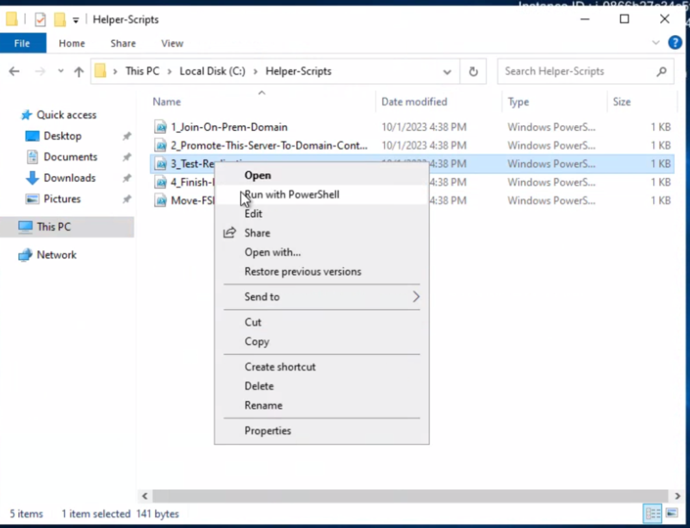

When prompted for the execution policy change, type A, then press Enter.

A Replication-Test-Results file appears. Open the file.

Compare your file to the file below. For example, if there are any
"Unknown" Source or Destination DSA's, there may be a replication issue
with Active Directory that may need to be addressed.

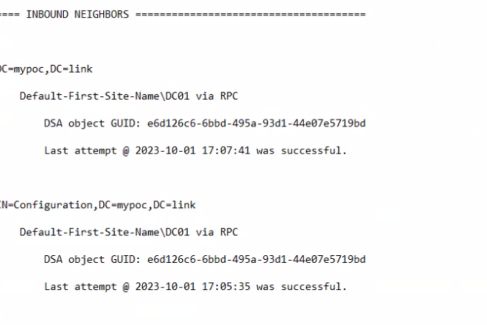

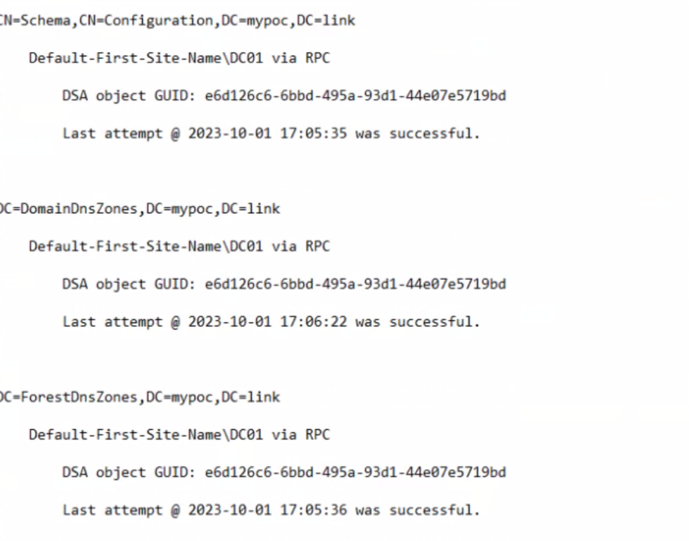

A healthy domain replication will have 5 inbound neighbor entries in the
replication test result.

In the section of output for the dcdiag utility, ensure that SYSVOL and
Netlogons checks have passed.

In a File explorer window, navigate to the SYSVOL share of each domain
controller, i.e. \\\\vpc-dc01\\sysvol . Each Domain Controller should
have a top level folder for the domain, then inside that folder will be
a Policies folder and a scripts folder.

If your test results differ, refer to section 4 of the troubleshooting
guide before continuing.

**Step 13) Finish the setup on vpc-dc01.**

Navigate to C:\\Helper-Scripts. Right click on 4_Finish-DC-Setup and
left click Run with PowerShell. This script enables the system state
backups and sets up the DNS conditional forwarder which enables
integration with other AWS services in the future.

**Step 14) Set up Domain Controller 2**

Repeat steps 9-12 on the second domain controller (10.32.8.132).

[]{#deploymentstep15 .anchor}**Step 15) Add the File Server to the
domain. (5 minutes)**

Repeat steps 9 and 10 to log into the file server (10.32.10.4).

Once connected via RDP to the file server, navigate to
C:\\Helper-Scripts. Right click 1_Join-Domain, and click Run with
PowerShell.

Accept the execution policy change by typing A and pressing Enter.

Enter the Domain Administrator credentials to join the domain.

After rebooting, connect via RDP to the file server. Navigate to
C:\\Helper-Scripts. Right click 2_Install-File-Server and click Run with
PowerShell.

**Step 16) Migrate files from on-premise file server to VPC file server**

This can be done through the migration tool of your choice; this
deployment guide will provide instructions for an automated method which
migrates file attributes, timestamps, security, owner information, and
auditing information.

Open C:\\Helper-Scripts. Right click 3_Migrate-File-Server and left
click Run with PowerShell.

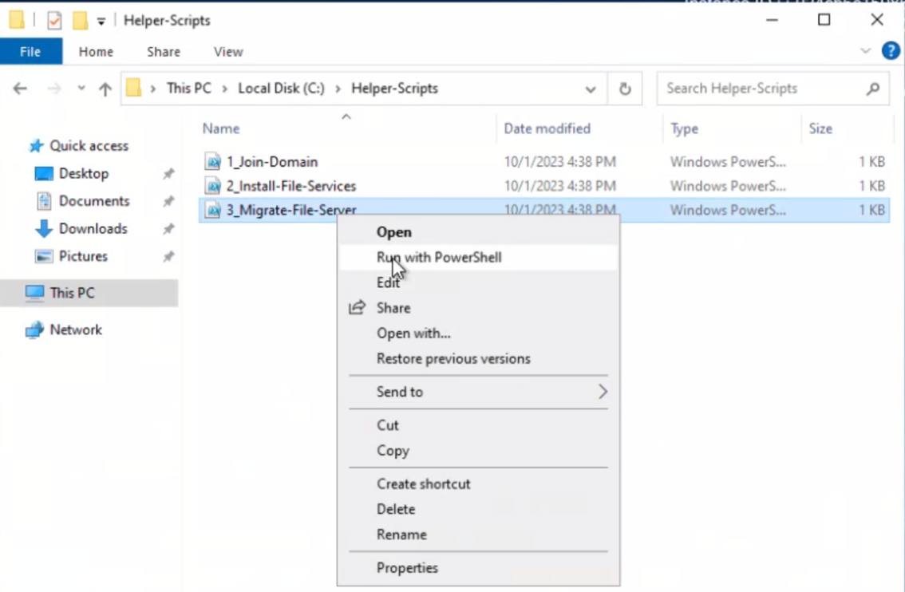

This method runs the robocopy commands, copying the files to the new
file server, and sharing the folders once copied. A log file of the
robocopy operation will be generated and placed in C:\\Helper-Scripts.

**Step 17) Ensure DHCP is set up correctly in the on-premises domain.**

In some networks, the Windows Domain Controller also provided DHCP
functionality. If this is the case for the on-prem network, an
alternative will need to be configured, assuming that the on-prem domain
controller will be decommissioned. **If the on-premise domain did not
use the Windows Domain Controller for DHCP services, this step can be
skipped.**

**Option 1)** Configure the internet gateway/firewall at the prem to
provide DHCP services for the on-premises network. The DHCP scope
options should be the same as the Windows Domain controller, except for
the DNS servers, which will now be the VPC domain controllers (is using
the Starter-Kit defaults, those would be 10.32.8.4 and 10.32.8.132).

**Option 2)** Configure the on-prem gateway/firewall to act as a DHCP
relay agent, set up the DHCP scopes in the Windows Domain Controllers in
the VPC as DHCP servers, and set the relay agent to forward DHCP
requests to the VPC domain controllers (10.32.8.4 and 10.32.8.132). If
this solution is required, best practice is to split the DHCP scope
between domain controllers for resiliency of DHCP services. For example,
if the on-prem network CIDR is 192.168.1.0/24, one VPC domain controller
would host DHCP with an address pool of 192.168.1.20 -- 192.168.1.128,
with a subnet mask of 255.255.255.0 and the other VPC domain controller
would host DHCP with an address pool of 192.168.1.129 -- 191.168.1.236.
A strategy like this leaves the first 20 and last 20 IP addresses in the
CIDR block available for static assignment such as local printers, etc.

**Step 18) Change the DNS Server Settings for the on-premises clients.**

Change the DHCP scope in the on-prem DHCP service to assign the
VPC-based domain controllers as the DNS Servers to the clients.

**Step 19) Transfer the FSMO Roles to a VPC domain controller and update TCP/IP DNS Settings and DNS Server settings in each Domain Controller.**

Transfer the FSMO Roles from the on-prem Domain controller to one of the
VPC-based domain controllers. This can be done via the
Move-FSMO-Roles-To-This-DC Helper-Script found in C:\\Helper-Scripts on
VPC domain controller 1. The script moves the roles, queries the domain
for the role owner, and logs the results in C:\\Helper-Scripts. You may
also manually perform this operation using the ntdsutil utility at the
command line. If you are unfamiliar with this operation, refer to the
following Microsoft KB article:
<https://learn.microsoft.com/en-us/troubleshoot/windows-server/identity/view-transfer-fsmo-roles>.

Once the FSMO has been transferred to a VPC domain controller, In the
properties of the Ethernet Adapter on each domain controller,
double-click Internet Protocol Version 4 properties. Under "Use the
following DNS Server addresses", modify each domain controller as
follows:

On the on-premise domain controller:

Preferred DNS Server: The IP of VPC-DC01 (Default: 10.32.8.4)

Alternate DNS Server: 127.0.0.1

Do NOT enter a forwarder on this Domain Controller.

On VPC-DC01:

Preferred DNS Server: The IP address of VPC-DC02 (default: 10.32.8.132)

Alternate DNS Server: 127.0.0.1

Add a Forwarder rule for the DNS Server. In the DNS Management console,
right click on the server (VPC-DC01) and click Properties. Click the
Forwarders tab. Click the Edit button. Add 10.32.0.2, and click OK.

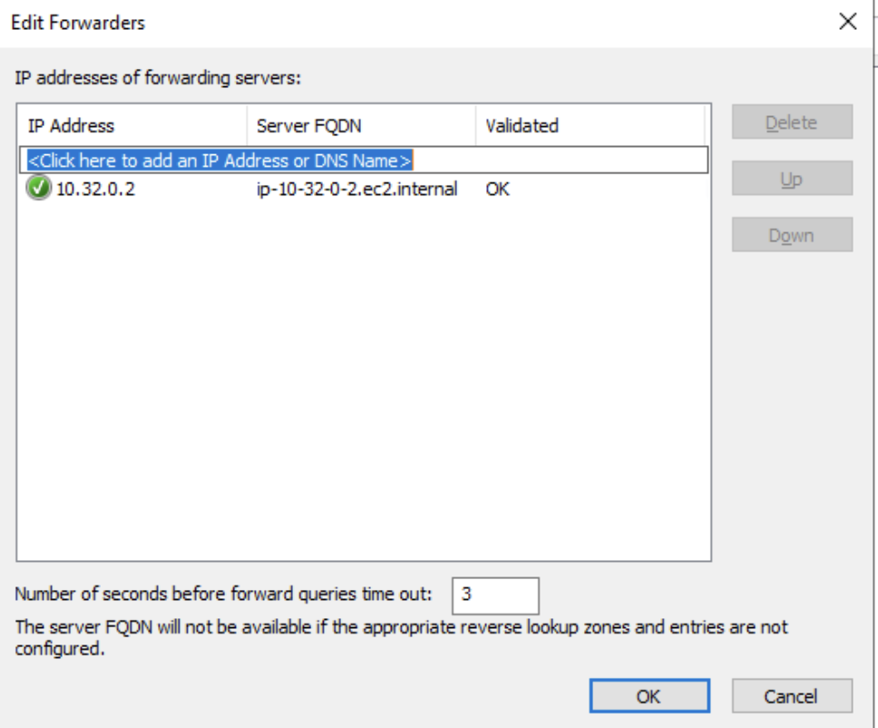

On VPC-DC02:

Preferred DNS Server: The IP Address of VPC-DC01 (Default:10.32.8.4)

Alternate DNS Server: 127.0.0.1

Add a Forwarder rule for the DNS Server. In the DNS Management console,
right click on the server (VPC-DC02) and click Properties. Click the
Forwarders tab. Click the Edit button. Add 10.32.0.2, and click OK.

**Step 20) Decommission the on-prem domain controller and file server.**

*This step should only be completed after an appropriate test and
burn-in time has elapsed, there are no outstanding issues that have
arisen from the migration, and a final backup of the on-prem server(s)
has been completed.*

a)  Ensure that user login scripts which map to server resources are
    updated to reflect the vpc-based resources, and that the user login
    experience (drive mappings, etc) has no issues.

b)  Ensure that the domain is syncing time from the AWS NTP Service. On
    VPC-DC01, run Utility-Sync-Time-To-External-Clock in the
    Helper-Scripts folder. If you wish to use an external time
    synchronization, use the command line to complete the operation. See
    the troubleshooting guide for an example.

c)  Remove operating roles from the on-prem server(s), i.e. demote the
    domain controller, and remove the Domain Controller roles and file
    server roles in Server Manager. This is the reverse of step 12.

d)  Unjoin the servers from the domain. Do not just unplug them prior to
    un-joining them. The on-prem server(s) can be un-joined in the
    reverse of step 11 where the VPC-based servers were joined to the
    domain, in Server Manager by clicking the computer name, and joining
    it to a workgroup, which can be any random name.

e)  The vpc-dcs-from-prem-dc-security group security group from the VPC
    Domain controller instances can be detached and deleted after
    removal of the on-prem domain controller.

f)  For domains that were migrated from pre-Windows 2016 domains, if
    there are no application compatibility concerns, the domain
    functional level should be raised to the current level (Windows
    2016). This can be performed in Active Directory Domains and Trusts,
    by right clicking on the domain, and selecting "Raise Domain
    Functional Level".

It is highly recommended that Vault locks be applied to the Backup Vault
for production workloads. Vault locks help protect backups from
lifecycle changes, accidental deletion, or malicious activities. For
more information, see the following documentation:
<https://docs.aws.amazon.com/aws-backup/latest/devguide/vault-lock.html>
.

**Get to know AWS Systems Manager.**

This Starter-Kit comes with AWD Systems Manager set up for basic
functions of being able to RDP to the Instances through Fleet Manager
and accessing the integrated CloudWatch health dashboard for the
Starter-Kit. There are many more useful functions which AWS Systems
Manager can perform, such as automated patching and patch management,
compliance checking to ensure that any required software or scripts have
been installed, and the ability to run commands on your instances
remotely. An MSP could quite literally build an entire practice
deploying solutions, and use Systems Manager to manage those
deployments, create run books and manage incidents in an integrated
wrapper. To learn more, visit the AWS Systems Manager home page at
<https://aws.amazon.com/systems-manager/?nc2=h_ql_prod_mg_sm> .

Systems Manager Quick Setup.

Connecting to an instance with Fleet Manager.

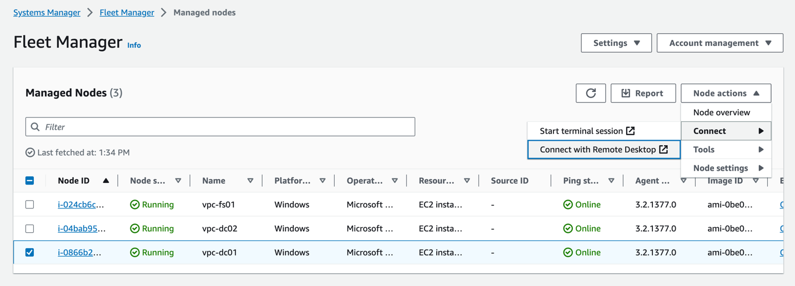

A screenshot of a Remote Desktop session in Fleet Manager.

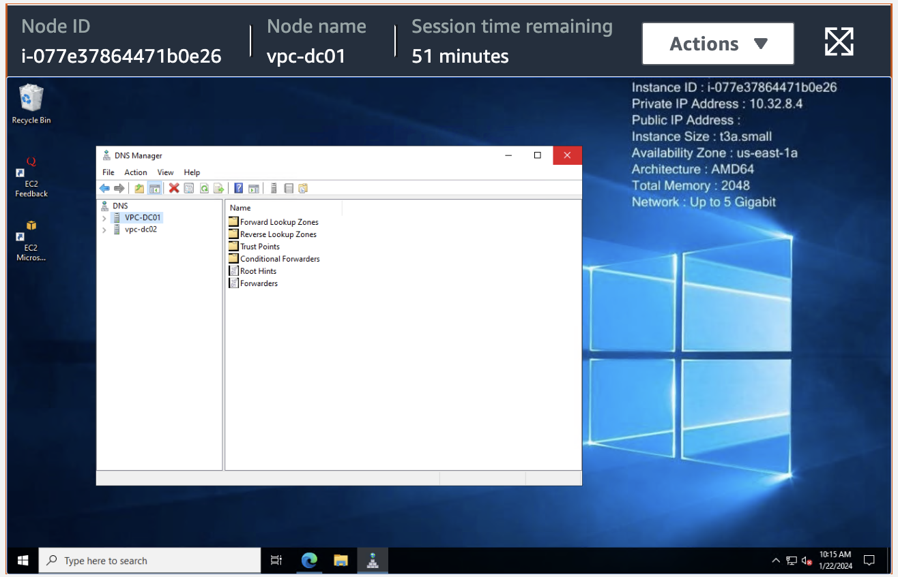

Your instance performance dashboard.

**Get to know AWS Backup.**

There are many ways to restore data with an AWS backup, ranging from a
draconian entire instance deletion and restore, to a gentle restore of
an attached EBS Volume. Your backups run automatically by default and
are stored in a backup vault which can be found by navigating to AWS
Backup, and in the hamburger menu, selecting Backup Vaults and clicking
on your backup vault. Visit the AWS Backup home page for more
information at: <https://aws.amazon.com/backup/>

The AWS Backup dashboard.

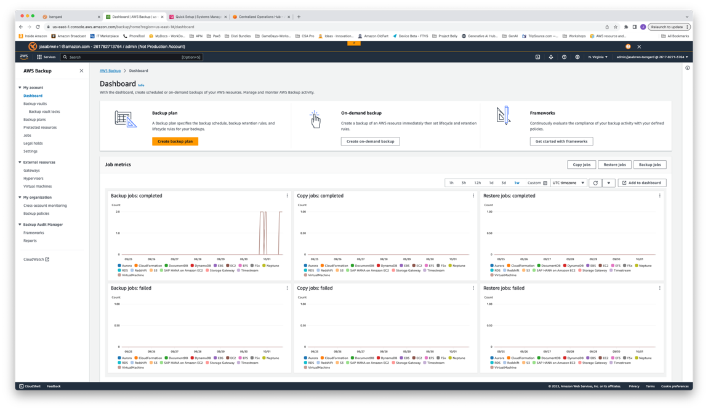

The AWS Backup Vault view.

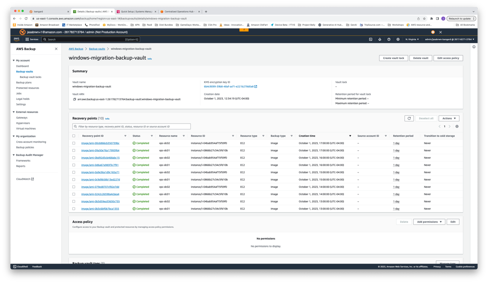
