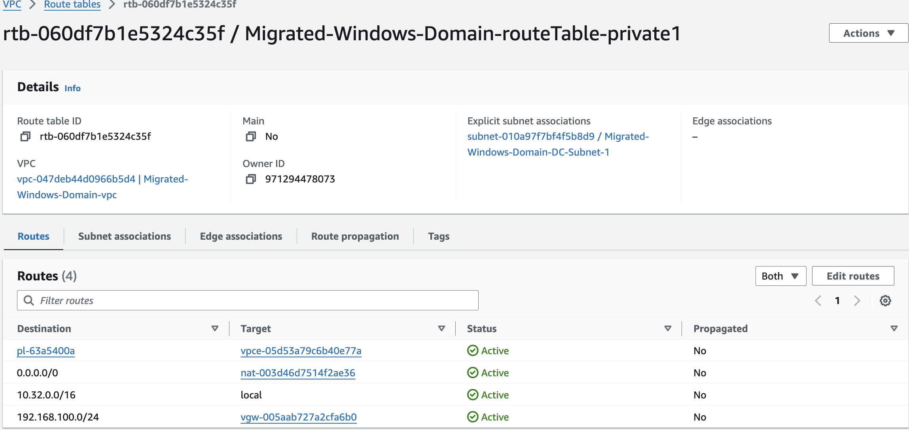

**AWS Starter Kits**

**Windows Migration Troubleshooting Guide**

**Section 1) Windows Time**

Windows Time must be set and synced properly before starting. Incorrect
time will cause a lot of errors; some may be unrecoverable if the time
difference is large enough. Making sure that Windows Time is working
properly in the on-prem domain controller will prevent a large number of
potential issues. Note that if the time skew is off by days, you will
have to set the date to the current date before performing these
commands.

The following command line example configures the w32time service on the
Domain Controller that is the PDC emulator (the domain controller in a
single DC environment) to sync to the time from time.nist.gov, then set
itself as the reliable time source for the windows domain:

C:\\Users\\Administrator\>w32tm /config /syncfromflags:manual
manualpeerlist:time.nist.gov /reliable:yes /update

The following command can be used to resync time on the domain
controller with the external time source:

C:\\Users\\Administrator\>w32tm /resync

You may have to restart the w32time service to see changes take effect.

C:\\Users\\Administrator\>net stop w32time

C:\\Users\\Administrator\>net start w32time

Documentation on the Windows time service can be found here:

<https://learn.microsoft.com/en-us/windows-server/networking/windows-time-service/windows-time-service-tools-and-settings?tabs=config>

**Section 2) Windows Firewall**

Verify that Windows Firewall is not restricting traffic between domain
controllers before changing NACLs or Security Groups in the AWS VPC. It
is recommended that you first troubleshoot any connectivity by disabling
the Windows Firewall through enforcing an Active Directory Group Policy
object which disables the firewall first before troubleshooting network
connectivity.

In order to troubleshoot connectivity, it may be necessary to allow ICMP
traffic in the network. ICMP is disabled by default in Windows as well
as at the Instance Interface Security Group level. To enable ICMP:

In the AWS Console, navigate to EC2.

Select the checkbox next to the machine you wish to allow ICMP. Click
the Actions button, then Security, then Change Security Groups.

Click the Select Security Groups field, and click on the allow-imcp
security group, then click the Add Security Group button.

To check the security groups attached to an instance interface, click on
the instance in the EC2 console. Scroll to the bottom, and click the
Security tab.

Enabling ICMP in Windows can be done via Active Directory Group Policy
(best practice) or via the Windows Defender firewall on individual
instances. Refer to these articles on how to enable ICMP in Windows:

<https://learn.microsoft.com/en-us/windows/security/operating-system-security/network-security/windows-firewall/create-an-inbound-icmp-rule>

<https://learn.microsoft.com/en-us/troubleshoot/windows-server/identity/config-firewall-for-ad-domains-and-trusts>

**Section 3) VPC Network Troubleshooting**

If you are experiencing connectivity issues, try the following:

a.  Check the VPC route tables to ensure that no routes have a status of
    "Blackhole". This should be looked at first when connectivity is not
    working between the on-prem environment and the VPC where, on rare
    occasions, the VPC route tables may be created before completion of
    the VPN Gateway attachment during stack creation. If this is the
    case, detaching and re-attaching the VPN gateway will fix the issue.

> 

b.  Enable VPC Flow logs, and examine the log files to find
    port/protocol packets that match your application. Documentation for
    VPC Flow logs can be found here:

> <https://docs.aws.amazon.com/vpc/latest/userguide/flow-logs.html>

c.  Ask Amazon Q. For example, ask Amazon Q "Why can't I RDP from my
    on-premise network to VPC-DC01?" and Amazon Q will configure a VPC
    reachability analysis for that network path and run it, telling you
    where the issue is, if there is one.

**Section 4) DNS**

Almost everything that has to do with Active Directory relies on DNS to
work properly. The command-line nslookup utility can provide insight
into DNS functionality in case name resolution does not work. Below is
an example of using the nslookup tool. The commands used are:

nslookup (opens the nslookup utility)

\>server \<IP address or host name of DNS server you wish to query\>
opens a connection over the DNS port to query DNS on the specified
server)

\>set q=a (this tells the DNS Server you wish to query for an "A"
record, or hostname record)

\>\<hostname you wish to query\>

In the below example, we opened the nslookup utility, queried each
domain controller to make sure each domain controller had a host record
of the other domain controller in DNS.

> 

If you see an error when running the server command in nslookup, i.e.
connecting to server 192.168.100.10 times out, try restarting the DNS
Server service on that computer. This is often the culprit when Active
Directory replication creates connection objects on one domain
controller, but not the other. Refer to the following Microsoft article
for more information on troubleshooting DNS issues:

<https://learn.microsoft.com/en-us/windows-server/networking/dns/troubleshoot/troubleshoot-dns-server>

**Section 5) General Active Directory Concepts**

Following this deployment guide step-by-step will help with the
deployment and migration. Sometimes, if steps were done out of order,
replication issues can arise, typically, replication inbound from the
VPC domain controllers to the on-prem domain controller. If any of the
Domain Controllers do not have a connection object, one may have to be
created. Refer to the following article on AD replication concepts here:

<https://learn.microsoft.com/en-us/windows-server/identity/ad-ds/get-started/replication/active-directory-replication-concepts>

**Section 6) Testing Migration.**

This bundle was tested using virtual machines to simulate an on-premise
workload consisting of a domain controller, file server and a windows
workstation. Testing of this bundle in a similar fashion is encouraged
prior to a live migration; it is recommended that any applications that
you use also be tested to ensure that raising the domain functional
level will not have any negative impact to applications. AWS Services
are billed by the hour; testing costs can be kept to a minimum with a
combination of snapshots of the on-prem environment which can be
restored before each testing session, and deleting the stack daily when
finished with testing. The beauty of AWS CloudFormation is the ability
to delete all of the resources created without worry of forgotten, rogue
components running up a bill.

**Section 7) Stack Deletion**

Navigate to AWS Backup in the AWS Console. In the left menu, select
backup vaults, and click on the backup vault. Under Recovery Points,
activate the top check box to activate all check boxes next to all
backups. Click Actions, click delete, then scroll to the bottom to
confirm by typing delete in the box and clicking the Delete Recovery
Points button.

Next, navigate to CloudFormation in the AWS Console. Activate the radio
button next to your stack, and click the Delete button. You will be
prompted to confirm again, and click the Delete button.

The stack may encounter an error if all of the backups have not yet been
deleted by the time the CloudFormation template deletes the backup
vault. If this happens, check to ensure that no backups are in the
Backup Vault and delete any backups that are in the vault (there may
have been an hourly one created as the stack was being deleted). delete
the stack again, and it should delete correctly.
