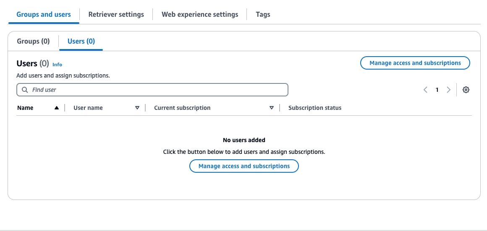

# Automation of Amazon Q deployment using Cloudformation with Amazon S3 and Webcrawler as datasources

Introduction

This deployment guide covers the steps to set up an Amazon Q solution that connects to an S3 and webcrawler datasource,  and integrates with AWS Identity Center for authentication. The CloudFormation template automates the deployment of this solution.

Amazon Q Business is a generative AI–powered assistant that can answer questions, provide summaries, generate content, and securely complete tasks based on data and information in your enterprise systems. It empowers employees to be more creative, data-driven, efficient, prepared, and productive.

Prerequisites

Before deploying the solution, ensure you have the following in place:

1. You will need an active AWS account with the necessary permissions to deploy CloudFormation stacks and create the required resources.
2. Amazon S3 Bucket: Ensure you have an existing S3 bucket that will be used as the data source for Amazon Q.
3. Amazon Identity Center: Configure Amazon IDC in your AWS environment. You will need to provide the necessary details, such as the Identity Center Instance ARN, during the deployment process.

Create Amazon S3 bucket

To creata S3 bucket, please follow the instructions on this [link](https://docs.aws.amazon.com/AmazonS3/latest/userguide/creating-bucket.html)

Identity Center Configuration

**"Starting April 30, 2024, all new applications will need to use IAM Identity Center directly to manage user access. No new applications can be created using the legacyidentity ** management ** flow.All ** existing ** AmazonQ ** applications ** usinglegacy identity management will need to migrate to using IAM Identity Center for user management by July 31, 2024."* *- [source](https://docs.aws.amazon.com/amazonq/latest/qbusiness-ug/idp-sso.html)

Therefore, if you do not have IAM Identity Center configured in the region in which you are creating your Amazon Q Business application, you will see this during the process:
This page provides a walkthrough of configuring the IAM Identity Center to manage users.

# Creating an IAM Identity Center instance

1. Go to the IAM Identity Center (**not** "just IAM", these are two services!) service in the AWS console. Alternatively, if you are prompted to create an IAM Identity Center instance during the creation of your Amazon Q Business application, you can click "Create Organization Instance"
2. On the right side of the IAM Identity Center page, you will be given an option to enable it:

Click the "Enable" button

3. You will be shown the configuration of your instance:

4. (Optional) IAM Identity Center allows you to select things such as the identity provider for your instance. Identity Center directory is used by default. If you wish to change it:
5. Click "Confirm identity source", or go to "Settings" on the left pane →"Identity Source“

6. Click "Actions" → "Change identitysource"

7. You can change the identity source here. For details,look [here](https://docs.aws.amazon.com/singlesignon/latest/userguide/manage-your-identity-source-idp.html)

These steps will allow you to connect an IAM Identity Center to your Amazon Q Business application during the creation process

# Creating Users

While creating an IAM Identity Center instance allows you to proceed with creating an Amazon Q Business application, you will need a user to log into the web experience. This section runs you through the creation process.

1. Go to the "Users" tab, available on the left pane. Click the "Adduser" button

2. Fill in the necessary details, presented below:

There are also additional information you can specify (contact methods, job-related information etc.), but this is not required

3. You may optionally add your user(s)to groups. This is optional

4. You will be presented a summary with the information of the user you are creating. Click "Add user"

5. You will receive an e-mail titled:*"Invitation ** to ** join ** AWS ** IAM ** IdentityCenter"*. Click "Accept invitation". You will be prompted to set the password for your user

After creating an Amazon Q Business application, you will be able to use these credentials to enter the web experience.

**Deployment steps**

Here are the steps to running this CloudFormation template

1. Go to the AWS Console click on CloudFormation and click on create stack

2.  In the Prerequisite - Prepare template section select Choose an existing template

3. In the Specify template section select Upload a template file and upload the Q Business CloudFormation template name QBusiness kickstarter template and click on next

4. In the Stack name enter a stack name

5. In the parameters section, go to your IAM Identity Center through the AWS console and copy the ARN of your IAM Identity Center Instance and enter as the IAMIdentityCenterARN and click next 

6. For the QBusinessApplicationName you can change the name to a unique Q business application name 

7. For S3DataSourceBucket copy the name of the S3 bucket you created earlier

8. For the WebCrawlerDataSourceUrl, enter any URL of your choice and click Next

9. In the Configure stack options section leave everything as default and click next

10. In the Review and create section check the I acknowledge that AWS CloudFormation might create IAM resources and click on submit

11. In the AWS console click on Amazon Q Business and you will see the new Q business application that was created from the cloudFormation template you deployed

12. Click on the new Q Business application and in the Data sources section click on the data source name **s3_datasource** and click on Sync now and do same for **webpage-datasource**

13. Go back to the application select the Group and users section and click Manage access and subscriptions.

14. Click on Users and click on Add groups and users. Select Add and assign new users if you didn’t create users in in the prerequisite section or select Assign existing users and groups if you created users in prerequisite section

15. If you are adding new users enter its Username, First name, last name, Email address, confirm email address and click next and click Add and finally click Assign. 

16. A mail will be sent to the email address you entered to create user. In the mail click on **Accept invitation**

17. Select the user and click on Change subscription dropdown and select Update subscription tier. In the New subscription dropdown select either Q Business lite or Q Business pro and click confirm and Done.

18. If you select Assign existing users and groups click on Next and put the user First name and select the user and click on Assign. Repeat step 17 to activate the subscription of the existing user

19. Click on Web experience settings and click on the deployed URL to access the Q application

**Testing** 

To ensure the Amazon Q solution is functioning as expected, perform the following tests:

1. Data Ingestion:

    * Upload a test file to the S3 bucket.
    * Verify that the file is successfully ingested and processed by Amazon Q.
    * Check the Amazon Q webexperience UI for the processed data.

1. Webcrawler Functionality:

    * Verify that the webcrawler is able to retrieve and ingest the data from the website.
    * Ensure the data is displayed correctly in the Amazon Q webexperience

**Architectural digram**

